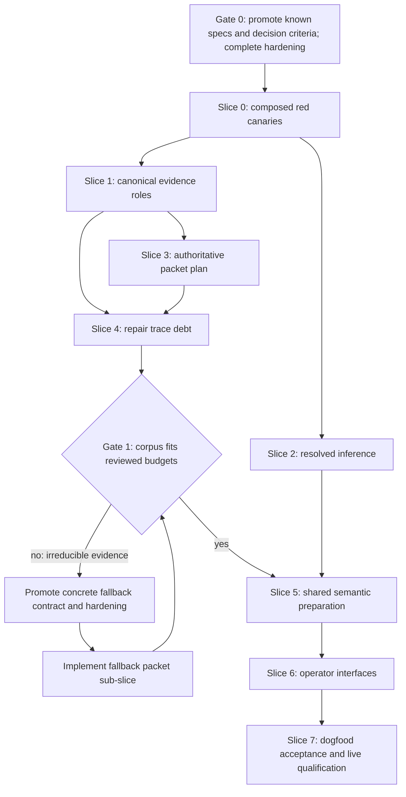

# Backstitch Usability Remediation Plan

Date: 2026-07-29

Status: completed; implementation, verification, and independent review PASS.
Owner-authorized integrated landing recorded with this plan's closeout. Gate 0
and Gate 1 passed; Slices 0–7, discovery-v2, the shared
preparation path, schema-2 cost preflight, and full hermetic dogfood are
implemented. Protected live qualification and the semantic qualification
corpus migration are green. The Phase B alignment preregistration now loads
against discovery-v2, but its honest product result fails the unchanged
capture and critical-candidate thresholds. The full non-live suite,
self-corpus checks, extended isolated dogfood, documentation-hash gates, and
direct final/follow-up independent reviews pass on the integrated worktree.
The post-correctness Grok/cost evaluation is recorded below; provider-free
speed work is a separately measured optimization slice and is not hidden
inside the correctness limits.

Plan type: implementation with coordinated spec revision.

Class: 5+P under [DOM-15]. The work changes normative CLI, configuration,
readiness, provider-request, cache-identity, artifact-publication, and
reporting contracts. It also crosses live-provider and protected-workflow
boundaries, so hardening is mandatory.

Promotion strategy: Strategy A for exact wording added to existing active
spec sections, followed by Strategy B when a changed mapping, code backlink,
or enumerable contract must land atomically. The spec-promotion slice adds no
new mapping block and no production code cites new requirements until the
corresponding code/mapping/backlink slice. A Gate 1 fallback, if triggered,
receives its own reviewed Strategy A/B delta before fallback code.

## Goal

Make Backstitch's ordinary workflows easy to understand and recover when they
fail. A user should not need source inspection, external JSON filtering, or
knowledge of internal configuration ownership to answer:

1. Can this repository be analyzed now?
2. If not, what blocks it and what exact command or edit comes next?
3. Which model and request will Backstitch send?
4. Will the run fit its packet, prompt, time, and cost budgets?
5. What work is in progress during a long command?
6. Which outputs will exist for each success or failure class?

Correct fail-closed behavior is necessary but not sufficient. The composed
operator journey must also reach a useful result.

## Outcome Checklist

- [x] Gate 0 exact spec text, hardening, promotion baseline, and independent
  review pass before shipping-code edits.
- [x] Composed red canaries prove the stable/raw identity, semantic-readiness,
  packet-budget, deadline, and public failure-presentation defects.
- [x] One resolved evidence-role owner feeds every diagnostic, readiness,
  invariant, summary, discovery, and packet consumer.
- [x] `ResolvedInference` separates stable identity, analyzer/verifier raw
  selectors, effective request, capability authority, and cache identity.
- [x] One authoritative `PacketPlan` supplies the exact bytes and budget facts
  consumed by packet publication, preflight, and execution.
- [x] Gate 1 accepts the self-corpus under reviewed representation and budgets
  with every debt transition dispositioned by identity.
- [x] Preflight and ordinary analysis consume one immutable preparation and
  preserve both currentness recaptures and publication precedence.
- [x] Text, JSON, help, filters, progress, and recovery commands expose the
  same structured facts without CLI-owned domain reconstruction.
- [x] Full hermetic success and readiness-failure dogfood journeys run in the
  normal suite; protected live qualification covers the committed default and
  GPT-5.5 override.
- [x] Specs, plan, implementation docs, mappings, backlinks, firing tests,
  acceptance probes, CI-equivalent checks, and the self-corpus gate agree.

## Source Documents

Required repository guidance:

- `AGENTS.md`
- `docs/agent-context/decision-hierarchy.md`
- `docs/agent-context/principles.md`
- `docs/agent-context/engineering-principles.md`
- `docs/agent-context/runbooks/writing-plans.md`
- `docs/agent-context/runbooks/hardening-plans.md`
- `docs/agent-context/runbooks/writing-specs.md`
- `docs/agent-context/runbooks/testing-patterns.md`
- `docs/agent-context/runbooks/adversarial-acceptance-probes.md`
- `docs/agent-context/runbooks/review-loops-and-agent-bootstrap.md`
- `docs/agent-context/runbooks/maintaining-traceability.md`
- `docs/agent-context/runbooks/writing-implementation-docs.md`
- `docs/agent-context/lessons.md`
- `docs/lessons.md`

Governing contracts:

- `docs/specs/01-development-documentation-operating-model.md` [DOM-5],
  [DOM-10], [DOM-11], [DOM-15]
- `docs/specs/02-backstitch-core.md` [SC-5], [SC-10], [SC-14], [SC-17]
- `docs/specs/03-backstitch-configuration.md` [CFG-5.1], [CFG-6.5],
  [CFG-6.7], [CFG-9]
- `docs/specs/05-backstitch-invariants.md` [INV-11]
- `docs/specs/06-semantic-gates.md` [SEM-3], [SEM-4], [SEM-7], [SEM-9],
  [SEM-10]
- `docs/specs/07-verification-and-evidence-cases.md` [EVC-2.1], [EVC-2.2],
  [EVC-5], [EVC-7], [EVC-8.3], [EVC-8.7], [EVC-9.1], [EVC-12]
- `docs/specs/08-intent-coverage.md` [COV-5], [COV-9]
- `docs/implementation/02-repository-map.md`
- `docs/implementation/07-deterministic-semantic-gate.md`
- `docs/implementation/08-aligned-intent-read-model.md`

Related active work:

- `docs/plans/2026-07-29-architecture-quality-remediation-plan.md`

The architecture plan created the typed application modules and removed the
legacy analyzer. This plan deepens those owners; it must not reopen the deleted
path or duplicate configuration, cache, publication, or parser ownership.

## Source Evidence

This inventory comes from a read-only command-surface investigation over the
current worktree and `HEAD`, plus two explicitly authorized, bounded live
requests to `gpt-5.5-2026-04-23`.

Observed baseline:

- `backstitch check --repo-root .` exits 0 with 122 sections, 395 mappings,
  447 code references, and zero active issues.
- Bare dispatch, `packets --kind all --report`, and
  `analyze --repo-root .` exit 2 at `ALIGNMENT_DEBT`.
- `HEAD` has 120 active evaluate obligations: 80 executable and 40 debt.
- The current worktree has 121: 72 executable and 49 debt.
- The current executable subset produces 72 packets and 44,844,121 aggregate
  JSONL bytes. A fresh exact measurement took 68.8 seconds.
- The corresponding aggregate model-request payload is 44,967,565 bytes.
  `[SEM-7]` defines `analyze.maximum_prompt_bytes` as an aggregate corpus
  ceiling; the committed ceiling is 1,500,000 bytes. The corpus therefore
  exceeds it by 43,467,565 bytes (96.66%).
- The largest single packet is 1,502,759 bytes and its complete model request
  is 1,504,586 bytes. These are per-request contributor facts, not values
  directly governed by the existing aggregate prompt key.
- Code inspection pins current prompt composition to
  `semantic_packets.prompt_instruction_bytes(kind)`, two LF bytes, and the
  canonical semantic packet projection. No provider, stable model, raw
  transport, effective-request, or capability field enters those bytes.
- The current discovery path does not expose phase events, so Gate 0 cannot
  truthfully attribute the observed 10.9–15.8 second deadline overrun by phase.
  Slice 0 must add provider-free characterization instrumentation and record
  the phase profile before Slice 3 changes deadline behavior. Until then,
  phase attribution is a named residual risk, not an inferred result.
- A valid self-repository candidate-detail request exceeded the default
  ten-second deadline in repeated runs. Wall time was 10.9 to 15.8 seconds.
- A production-style stable-PURL/raw-adapter model split fails before provider
  construction because the adapter requires both strings to be equal.
- One live GPT-5.5 request with `temperature = 0.0` reached the provider once
  and failed with HTTP 400. The otherwise identical request with
  `temperature = 1.0` exited 0 with one complete evidence-bound result.

Live success artifact hashes retained from the investigation record:

```text
result JSONL:
6f5ea195faf524cef08b1f2fdc2c2bc895253dfd1c25c868a8d8950fcd2cfe9b
analysis report:
388915b95fa862fec0cd2a2726bafabfc112802e5978d80854b4cef37a95f48d
```

The post-remediation protected GPT-5.5 qualification used exact raw snapshot
`gpt-5.5-2026-04-23`, stable identity
`pkg:service/openai.com/gpt-5.5`, temperature `1.0`, seed `42`, and a
1,024-token logical output cap. The first complete-descriptor attempt exposed
that the `llm` OpenAI adapter sent the obsolete `max_tokens` wire field; the
shipping shim had incorrectly inspected the stable PURL rather than the raw
adapter ID. After that boundary fix, a 512-token run produced one valid section
result and one truncated/malformed suppression result. Raising only the
GPT-5.5 qualification cap to 1,024 made both packet-bound structured results
complete while retaining the exact $0.10 conservative ceiling. The successful
run completed in 21.80 seconds with two calls, zero problems, and a 99,550
microusd conservative estimate; exact replay made zero calls and reproduced
the result JSONL byte for byte.

```text
result and replay JSONL:
883fe63a59949b00ff19a2887498250b62b8865aeec53f679db446eb95da454b
analysis report:
5ca3d36e435f52e0ff6b6626543554852dbd712bbb8b883ea97a6e2859d0ba2d
replay analysis report:
49c7817764e5b3873c4cd3b0527e1aa83d32b77e866223b7a5ee2accac95ff86
```

The matching protected GPT-5.4-mini qualification used exact snapshot
`gpt-5.4-mini-2026-03-17`, stable identity
`pkg:service/openai.com/gpt-5.4-mini`, temperature `0.0`, seed `42`, and a
512-token output cap. It passed in 4.77 seconds with two calls, zero problems,
and a 10,325 microusd conservative estimate. Replay again made zero calls and
reproduced result bytes exactly.

```text
result and replay JSONL:
9e65f3179315fd16f6b79643773382b64568e4842b1c306509f7bb5ff23e5939
analysis report:
c0e4e01267d2ee5bc7e291cb60542ba7461c55fc1a088a9095dc961ac384dcc4
replay analysis report:
c75d6ac66e16ffd7be3956294e972a38a4d82bec93614d272f5a214cdadd2f30
```

Gate 0 baseline reruns on 2026-07-29:

- `uv run pytest tests/acceptance -q -o run_live_llm=false` passed 45 tests;
- `uv run backstitch analyze --repo-root . --format json` exited 2 with only
  `ALIGNMENT_DEBT: current repository has active non-executable alignment
  debt`; and
- `uv run backstitch check --repo-root .` exited 0 with zero issues.

Post-Slice-2/trace-repair Gate 1 measurement on 2026-07-29:

- `uv run backstitch check --repo-root . --format json` exits 0 with 122
  sections, 467 code references, 368 mappings, and zero errors or warnings;
- current preflight reports 110 executable obligations, zero blocked
  obligations, and one intentionally non-evaluated obligation;
- ordinary planning stops on packet 4 at
  `docs/specs/02-backstitch-core.md#SC-1`, after 1,995,063 aggregate request
  bytes, against the committed 1,500,000-byte aggregate ceiling;
- diagnostic continuation measures all 110 packets: 84,935,097 aggregate
  request bytes and a 2,550,926-byte largest request, against the trusted
  1,600,000-byte per-request capability ceiling;
- 19,768,781 bytes are exact same-span source text repeated across declared
  and counterevidence roles. Removing only that duplication still leaves a
  65,238,716-byte aggregate lower bound and a 1,658,303-byte largest-request
  lower bound;
- setting the existing discovery control `static_neighbor_depth = 0` still
  yields 47,083,922 aggregate request bytes and a 1,993,746-byte largest
  request. Reducing lexical seeds from ten to one changes that only to
  45,825,435 and 1,993,161 bytes.

These complete measurements trigger Gate 1 branch 2. The independent review
recomputed 110 packets, about 85.19 MB of aggregate request bytes, a 2.56 MB
largest request, and a conservative cold-cost floor of about $64.17. Even an
impossible zero-evidence projection would require about 1.45 MB across 110
requests and exceed the committed call-count and $1 cost ceilings. A
ceiling-only increase is therefore rejected as green-but-unusable and cannot
override the trusted 1.6 MB per-request capability.

The review found 2,818 source-span occurrences but only 568 unique spans:
67.44 MB of occurrence text collapses to 4.78 MB of unique text. All current
spec mappings are path-owned, and most reciprocal backlinks are module-level,
so mass symbol rewriting is not yet a truthful narrowing result. Gate 1 now
promotes discovery-v2 as the smallest contract-preserving correction:
`enclosing_definition` becomes orientation metadata rather than an undirected
neighbor hop; one depth unit traverses a collapsed definition-to-definition
conservative relation; and exact role-independent visible source spans render
once while authoritative discovery facts and packet aggregate memberships
remain complete. Schema 3 already does not carry an individual row for an
exact declared duplicate; requiring such a row would trigger a separate packet
schema change. The discovery algorithm version must cold-miss current caches;
historical packet readers remain exact. Gate 1 will be remeasured before any
budget literal changes.

Discovery-v2's complete remeasurement produced 110 packets, 32,800,899 packet
bytes, 32,989,989 aggregate request bytes, a 1,090,711-byte largest request,
and a $25.017096 conservative cold-cost ceiling. It fixes the trusted
1.6 MB per-request capability violation and cuts the prior conservative cost
by about 61%, but it does not make the cold run cheap.

The user then clarified the pre-release priority: make it work, make it
correct, then make it fast and cheap. Gate 1 therefore accepts explicit
project limits of 40 MB packet/request bytes, 128 packets/provider calls, and
$30 conservative cold cost while retaining the trusted 1.6 MB per-request
capability. These are functional headroom, not an efficiency claim. A later
batch/shared-source protocol remains an optimization and no longer blocks
functional dogfood.

Deadline trials are also part of the discarded-design record. Ten and thirty
seconds expired in `relations`; 180 seconds expired in `closure`. After
reducing deadline clock sampling from every work operation to the specified
bounded interval, complete preparation plus trust-boundary validation took
261.54 seconds on the local reference machine and exposed a schema-4 validator
defect. The repository limit is now 600 seconds for measured platform margin.
The absolute cooperative deadline contract is unchanged; the speed phase must
profile the remaining preparation/validation cost rather than hiding it.

No Backstitch release has shipped. Historical discovery-v1 and schema-3/4
readers are retained where they cost little, but compatibility is not a
release constraint and must not force a weak new protocol. The plan and
implementation record preserve tried/discarded designs and reasons. A future
packet or request protocol may replace them directly behind a new identity.

### Post-correctness cost and provider decision

The user set the optimization order after the functional limits were accepted:
make it work, make it correct, then make it fast and cheap. Provider selection
therefore cannot weaken the green functional and correctness contracts, and a
lower advertised token price is not by itself a migration decision.

Grok was evaluated after the correctness gates passed. On 2026-07-29, xAI's
authenticated, non-inference `GET /v1/language-models/grok-4-latest` resolved
the requested alias to `grok-4.3`, version `1.0`, fingerprint
`fp_dec7a6a673`. The returned canonical aliases were `grok-4.3-latest` and
`grok-latest`; the legacy-looking requested alias still resolved but should
not be committed as the stable transport selector. The current
[Grok 4.3 model page](https://docs.x.ai/developers/models/grok-4.3) documents
structured outputs, a one-million-token context, and $1.25 input, $0.20
cached-input, and $2.50 output rates per million tokens. The
[pricing table](https://docs.x.ai/developers/pricing) doubles uncached input
and output rates to $2.50 and $5.00 for requests at or above 200,000 prompt
tokens.

That candidate is not cheaper under Backstitch's reviewed cold preflight.
Discovery-v2 retains 32,989,989 request bytes across 110 calls. The current
byte-as-token ceiling plus 256 framing tokens per request produces the
committed GPT-5.4-mini estimate of $25.017096. Applying Grok 4.3's
short-context rates to the same conservative quantities yields about $41.414
after per-request rounding. Backstitch cannot currently prove from byte counts
which requests remain below xAI's token threshold, so the safe one-rate
descriptor would have to use the long-context rates for all requests, about
$82.827. Assuming cache hits would make a cold preflight dishonest. xAI
documents prompt-cache usage separately and returns exact billed
`cost_in_usd_ticks` after a call, but neither fact replaces the pre-call cold
ceiling.

The local `llm` runtime also had no Grok registration (`llm plugins` returned
an empty plugin list and `llm models list` contained no Grok model). Its
built-in OpenAI-compatible adapter can register an xAI endpoint, but
Backstitch has not reviewed an xAI capability descriptor, long-context cost
rule, adapter provenance, or live-test branch. A paid Grok inference was
therefore not run and the committed default remains GPT-5.4-mini.

This is a defer-and-qualify decision, not a rejection of Grok quality. A later
provider optimization slice must:

1. register an exact Grok snapshot through an isolated OpenAI-compatible
   transport and preserve `x.ai` as the stable service identity;
2. add a reviewed structured-output/request capability descriptor and firing
   tests without provider-name conditionals in the generic resolver;
3. add a threshold-aware ceiling that uses the short rate only below 200,000
   request bytes and the long rate otherwise, add reviewed tokenizer evidence,
   or use the long-context rate for every request;
4. run the existing bounded two-packet live journey and record exact billed
   cost, latency, cache tokens, result validity, and evidence quality; and
5. compare the same packets with the current default before changing any
   repository selector.

The first speed target is provider-free preparation, not a model swap. The
instant hermetic model still leaves the extended self journey at about 15.5
minutes, while one complete preparation plus trust-boundary validation was
measured at 261.54 seconds. That is evidence that repeated discovery,
validation, and snapshot work across composed commands dominates the dogfood
path. A speed slice should profile command-by-command phase receipts, then
remove repeated work behind currentness-bound, content-addressed artifacts.
It must not add a second analysis path or trust mutable cache state.

A direct read-only `claude -p` follow-up independently reproduced the
GPT-5.4-mini, Grok short-context, and Grok long-context estimates and returned
`PASS` with no P0-P2 finding. It also identified the safe byte-threshold
variant now listed in step 3: fewer than 200,000 UTF-8 bytes proves fewer than
200,000 tokens, while larger requests can conservatively take the long rate
without pretending that bytes prove the actual token count.

## Spec Baseline

Plan-authoring and architecture-remediation base:

```text
506ef048ae785a845f3bed473e774be80f0972d7
```

This plan starts on top of the reviewed but uncommitted architecture-quality
spec promotion. The full current `docs/specs` diff against that base has
SHA-256:

```text
b499459247e58713aa25331a58ba4788085e52c495d0da28f6a57c58669472c6
```

The five specs directly targeted by this plan (`02`, `03`, `06`, `07`, `08`)
have a combined diff SHA-256:

```text
50369d838b0a903739c8ea538f4a1af6c3e84f95f224479e4f6bc74e2eeb31e1
```

Those identifiers are the pre-promotion baseline. Gate 0 must record a new
worktree diff digest after the exact usability delta is promoted. No
compliance claim after promotion uses the hashes above.

Gate 0 exact promotion completed against that dirty architecture baseline.
The full current `docs/specs` diff now has SHA-256:

```text
ba3a90717fe9e3f40360a7a0c4577f725bb6722b7a3c9fb74c0a7823d8781db8
```

The coordinated `02`/`03`/`06`/`07`/`08` diff has SHA-256:

```text
cca70e37c1070b2f7726ff50e923a1182411e74603efe667a91b67f9a5ba9c13
```

Together with the pre-promotion hashes, these identify the exact before and
after states without misattributing the earlier architecture promotion.

## Deviation Log

| Spec ref | Planned behavior | Actual behavior | Rationale | Spec proposal |
|---|---|---|---|---|
| [SEM-7], [EVC-9.1] | Preserve analysis-report schema 5 | Schema 5 cannot retain the raw analyzer and verifier transport selectors selected for a run | Stable identity and raw transport must be separately auditable without putting raw aliases into cache identity | Analysis-report schema 6 adds `selected_inference.adapter_model_id` for the analyzer and `verification.contract.adapter_model_id` for the verifier; exact schema-3/4/5 readers remain, cache object/key schemas do not change |

## Current Structure And Required Reading

Read these owners before editing their slice:

| Concern | Current owner and behavior | Closest real tests |
|---|---|---|
| Current/historical analysis | `backstitch/semantic_application.py` validates mode and paths, captures the current runtime, generates packets independently, invokes `semantic_analysis`, recaptures currentness, and publishes | `tests/test_semantic_application.py`, `tests/test_cli.py` |
| Standalone packets | `backstitch/packet_application.py` captures another runtime, independently generates and renders packets, builds a report, and publishes | `tests/test_packet_application.py`, `tests/test_analysis_packets.py` |
| Packet eligibility and bytes | `backstitch/analysis_packets.py::generate_source_aligned_packets` owns readiness and evidence projection; `render_packets_jsonl` serializes only after the complete list exists | `tests/test_analysis_packets.py`, acceptance packet probes |
| Provider adapter | `backstitch/analysis_llm.py::default_provider_adapter` currently requires the raw model selector to equal stable `ProviderIdentity.model_id`, then derives options again from `RequestIdentity` | `tests/test_analysis_llm.py`, `tests/test_live_llm_helpers.py`, `tests/live/test_live_llm.py` |
| Inference/cache identity | `backstitch/semantic_identity.py` hashes provider, request, prompt, packet, and epochs; `semantic_analysis.ResolvedSemanticSettings` drops the raw adapter selector before CLI constructs adapters | identity, semantic-settings, cache, verification, and canonical-owner tests |
| Evidence roles | `obligations.py::_evidence_role`, `evidence_summary.py::_role`, and `obligation_runtime.atomic_invariant_targets` classify overlapping facts independently | obligation, evidence-summary, invariant, and acceptance probes |
| Discovery deadline | `evidence_discovery.py` owns snapshot-bound catalog and candidate derivation work; checkpoints do not yet bound every expensive phase | evidence-discovery, obligation CLI, wall-clock tests |
| CLI presentation | `backstitch/cli.py` is an adapter over typed application modules but still owns semantic adapter construction and renders opaque readiness failures | CLI, doctor, application, and acceptance tests |
| Publication | `artifact_publication.py` owns staging plus ordered per-path atomic replacement; semantic application owns the two currentness recaptures, digest-bound logical-set validity, and failure precedence | artifact-publication and semantic-application tests |

Comprehension gate before each relevant edit:

1. Which exact tuple defines semantic cache identity, and which raw transport
   selector is deliberately provenance-only?
2. Which currentness recapture prevents provider work on stale preparation,
   and which recapture prevents stale work from publishing as current?
3. Which owner must retain the canonical packet bytes so `packets`, preflight,
   and analyze cannot measure and send different content?
4. Which resolved evidence atom is consumed by deterministic diagnostics,
   readiness, invariants, summaries, discovery, and packet projection?
5. Which failure stages may publish historical attempted-call evidence, and
   which current/preflight stages must publish nothing?
6. Why may doctor construct the exact local model wrapper but not capture a
   repository snapshot or build packets?

An implementer who cannot answer the relevant question from spec and code
must stop and read the named owner and its nearest tests before editing.

## Invariants And Constraints

1. **One shipping seam.** `packets`, preflight, current analyze, and historical
   analyze may have context adapters but never independent readiness, packet,
   request, cache, or publication logic.
2. **Deterministic work remains provider-free.** `check`, `coverage`,
   `obligation`, `packets`, `guide`, and preflight make no model call, read no
   credential, mutate no cache, and publish no semantic result/report.
3. **Stable and transport identities stay distinct.** Stable provider identity
   controls cache and provenance; analyzer and verifier raw selectors control
   transport only within the same trusted stable revision.
4. **The effective request precedes identity.** Compatibility validates a
   frozen inference-affecting request before `RequestIdentity` is derived.
   Adapters serialize it and add only the already resolved transport selector.
5. **Cache compatibility is fail-closed.** Unchanged logical requests retain
   byte-identical keys. Any inference-affecting change misses. An unavoidable
   envelope change receives a version bump and never falls back to old keys.
6. **Evidence roles have one owner.** A valid test source cannot become a
   broken implementation target in another consumer. Invalid production
   evidence still blocks readiness with exact source identity.
7. **Measured bytes are sent bytes.** A complete `PacketPlan` retains the exact
   canonical bytes it measured. An incomplete prefix is never replayable or
   publishable.
8. **Failure precedence does not move.** Invalid input and unaccepted snapshots
   block later claims. Current output remains atomic. Historical attempted-call
   evidence remains auditable where [EVC-8.7] permits it.
9. **Currentness has two checks.** Execution recaptures before cache/provider
   work and before current publication. A mismatch at either point cannot
   produce a current artifact.
10. **Deadlines are absolute and cooperative.** One monotonic deadline crosses
    every expensive discovery/packet phase. Bounded checkpoints define the
    maximum overrun. Progress never extends the deadline.
11. **Progress is noncanonical.** Only a TTY/stderr adapter renders progress.
    JSON/stdout, cache identities, artifact bytes, and report hashes never
    contain progress events.
12. **No new dependency.** This work does not add Pydantic or another package.
    Frozen dataclasses and the existing total artifact/config validators remain
    the canonical model. Pydantic is transitive today, not a declared project
    contract, and would not solve the ownership defects.
13. **Protected live work stays explicit.** Hermetic dogfood uses a local
    deterministic model through the real adapter. Remote calls occur only in
    the protected scheduled/release lane under a reviewed count and cost cap.
14. **Markdown ownership does not move.** `markdown-it-py` remains the sole
    Markdown block parser. This plan adds no shadow parser or parser state
    machine.
15. **Existing architecture work is preserved.** Do not restore deleted legacy
    analysis, import cycles, CLI orchestration, duplicate config resolution, or
    separate cache/publication state machines.
16. **Discovery versions are fail-closed.** In discovery-v2,
    `enclosing_definition` is orientation only; modules never become collapsed
    endpoints; one depth unit is one definition-to-definition conservative
    hop with its orienting reference retained. Exact visible-source dedup
    changes no discovery fact or packet aggregate membership. The version bump
    cold-misses current caches while historical discovery-v1 schema-3/4
    artifacts remain exact and are never normalized as current v2 output.
17. **Preflight budgets are conservative and provider-free.** PacketPlan owns
    exact retained request bytes; one shared lower-layer cost owner supplies
    both execution enforcement and schema-2 preflight projection. Preflight
    never reads cache state or fabricates verifier work. A cold analyzer fit
    proves the configured call/cost ceiling; a read-write cold exceed declares
    cache dependence rather than blocking a potentially valid warm run.

## Hidden Couplings

| Coupling | Required action |
|---|---|
| Provider descriptor, raw selector, request controls, prompt descriptor, packet hash, search epoch, and policy all affect semantic reuse | Resolve once; enumerate identity-preserving and identity-changing fields in firing tests before changing constructors |
| Analyzer and verifier use different raw selectors but share stable-identity rules | Migrate both roles in the same slice; analyzer-only success is incomplete |
| Packet report digests, analysis identities, cache keys, and provider prompts depend on canonical packet bytes | Retain one canonical byte set and update every producer/consumer atomically |
| Preflight and execution share preparation but source may change between or during them | Preserve both recaptures and test each mutation window through the public seam |
| `check` diagnostic authority and semantic readiness are intentionally distinct | Add a provider-free readiness surface; do not relabel semantic debt as a deterministic issue unless its own producer contract says so |
| Current and historical modes have different publication authority | Keep mode and currentness explicit in preparation and rendering; never infer mode from path presence downstream |
| Candidate discovery reuses one snapshot catalog across obligations | Thread one deadline and optional event sink through catalog and per-obligation work without rebuilding or leaking mutable trace state |
| Progress shares long-running paths but not canonical state | Use one closed event vocabulary with TTY and no-op adapters; never callbacks under locks or publication |
| Execution cost is cache-aware while preflight forbids cache reads | Share cost validation/math, project a labeled conservative cold analyzer bound, and leave exact planned misses under execution ownership |
| Capability qualification receipts mention request identity but are not semantic inputs | Receipt refresh cannot change cache identity; changed capability behavior requires reviewed descriptor revision |
| Ratchet mode rejects ordinary runtime config controls | Improve recovery text/help without adding an override that weakens committed authority |

## Rollout, Rollback, And One-Way Doors

Rollout is slice-ordered:

1. promote reviewed text for known contracts;
2. add red canaries with no production behavior change;
3. land compatible internal owners while old public shapes still validate;
4. cross Gate 1 before semantic preparation or UI work;
5. add preflight/read-view fields with versioned loaders and firing tests;
6. add hermetic dogfood before enabling protected live qualification; and
7. reconcile mappings/backlinks only with their real owners.

Rollback rules:

- Before a code slice, Strategy-A spec text can be reverted independently.
- Internal owner moves remain source-compatible until all callers migrate;
  rollback reverts the coherent caller/owner slice, never one caller.
- This plan intends no cache-key or artifact-schema migration. If tests prove
  one unavoidable, stop, record a deviation, promote a versioned contract, and
  make rollback ignore the new namespace rather than read it through an old
  shape.
- A preflight or obligation read-view schema revision keeps historical loaders
  strict; do not add permissive dual-shape fallback.
- Gate 1 branch 2 is a one-way contract decision. No fallback code begins until
  its representation/budget delta and rollback are independently reviewed.
- Protected workflow changes ship only after hermetic tests; rollback disables
  the scheduled/release job without weakening ordinary local or CI gates.

One-way doors requiring a stop and new review:

- changing cache or request canonicalization;
- changing packet/result/report schema versions or byte projections;
- publishing partial packet prefixes;
- exposing a credential to a new workflow step or mutable third-party action;
- adding a dependency; or
- changing deterministic issue authority to make semantic readiness green.

## Failure Priority Matrix

| Failure | Authority and exit | Side effects allowed | Required presentation |
|---|---|---|---|
| Invalid CLI/config/output overlap | invocation/tool, exit 2 | no snapshot, cache, model, temp, or artifact work | exact field/path and recovery |
| Snapshot rejected or deterministic fail-on issue | target or invocation per existing owner | no model/cache/result publication | existing structured issue authority |
| Semantic readiness debt | invocation cannot execute current analysis, exit 2 | no model/cache/current artifacts | total count, reason groups, bounded IDs, exact obligation command |
| Capability/request incompatibility | invocation/tool, exit 2 | local wrapper construction allowed; no credential, network, cache, or artifact | stable ID, raw selector, field, accepted values, dotted-key remedy |
| Packet count/packet-artifact/aggregate-prompt/per-request-capability overflow | invocation/tool, exit 2 | measured prefix facts only; no partial pair or provider work | crossed ceiling, first crossing, measured bytes/contributors, unmeasured count |
| Deadline exceeded | invocation/tool, exit 2 | cooperative cleanup only; no partial page/pair/current artifact | phase, configured limit, observed bounded overrun, dotted-key remedy |
| Cache/provider/normalization/verification failure | exit 2 under [SEM-7] | historical attempted-call evidence only where contract permits | structured stage/code; no traceback |
| Source changes before execution | currentness failure, exit 2 | zero cache/provider work | preparation/current snapshot identities |
| Source changes during execution | currentness failure, exit 2 | attempted-call evidence may remain historical; no current artifact | both snapshot identities and artifact disposition |
| Artifact publication fails | exit 2 | ordered rollback/cleanup per publication owner | failed path and published-path audit |
| Progress renderer fails | best-effort unless it corrupts canonical stream | core work continues with progress disabled | never changes stdout, exit, or artifacts |
| Qualification provider unavailable | qualification unavailable, distinct from incompatible | no descriptor mutation | provider/transport and retry policy |
| Qualification request rejected | qualification incompatible | no descriptor mutation or auto-correction | exact request identity and provider response class |

## Anti-Mocking Contract

| Proof | Must stay real | Permitted substitution |
|---|---|---|
| Readiness failure journey | installed CLI, config resolution, snapshot, obligation runtime, readiness owner, renderer | isolated copied corpus only |
| Stable/raw adapter journey | descriptor resolution, `llm` lookup, real adapter constructor, request serialization | test-owned registered local model or local endpoint |
| Packet plan | real repository snapshot, obligation runtime, evidence discovery, canonical serialization, report loader | fake monotonic clock and no-op event sink |
| Preflight/execution parity | installed CLI, same preparation, packet bytes, cache coordinator, loaders, publication | local model computation |
| Cache hit/miss | real cache files, identity builders, locks, audit, public analyze | deterministic local model |
| Currentness races | real isolated filesystem and public command/application seam | controlled clock/barrier at the external scheduling seam |
| Progress | real long-running owner and CLI renderer | TTY/no-op adapters; fake clock |
| Capability drift | production descriptor, real adapter, bounded provider request, receipt validator | none in protected live lane |

Tests may not monkeypatch or directly invoke the settings resolver, evidence
role owner, packet planner, semantic application, adapter, cache coordinator,
or artifact loaders when claiming composed coverage. Focused unit tests may
exercise pure validation, but they never substitute for the public firing
case.

## UX Contract

### Analyze preflight and failure rendering

`analyze --preflight` uses the ordinary current-repository input grammar and
forbids historical packet input and every semantic output path. It exits `0`
when preparation is executable or validly all-skipped, `1` when deterministic
target policy finds a selected failure, and `2` when preparation or invocation
is blocked. It performs no provider call, credential read, cache mutation,
semantic output temporary, or artifact publication.

`--format json` writes one closed `analysis-preflight-v2` object to stdout for
both ready and provider-free blocked outcomes; stderr is empty. Invalid CLI or
malformed configuration remains a one-line stderr error with empty stdout.
The object contains:

```text
{
  "schema_version": 2,
  "operation": "analysis.preflight",
  "ready": boolean,
  "selected_command": "analyze",
  "config": {selected_path, settings_sha256},
  "snapshot": {snapshot_hash, file_count, byte_count}|null,
  "readiness": {
    total, executable, blocked,
    reason_groups: [{code, count, example_obligation_ids}],
    next_command
  }|null,
  "packet_plan":
    {
      status: "complete", complete: true,
      packet_count, packet_bytes, aggregate_prompt_bytes,
      maximum_request_bytes
    }
    | {
      status: "over_budget", complete: false, crossed_ceiling,
      measured_packet_count, unmeasured_packet_count,
      measured_packet_bytes, measured_prompt_bytes,
      first_crossing_packet_id,
      top_measured_contributors: [{
        packet_id, kind, packet_byte_count, request_byte_count
      }]
    }
    | null,
  "inference": {
    analyzer: {
      stable_model_id, adapter_model_id, capability_revision,
      effective_request, request_identity
    },
    verifier: {
      stable_model_id, adapter_model_id, capability_revision,
      effective_request, request_identity
    }|null
  }|null,
  "budgets": {
    projection: "conservative_cold",
    limits: {
      maximum_packets, maximum_prompt_bytes, maximum_input_bytes,
      maximum_provider_calls, maximum_estimated_cost_microusd,
      maximum_runtime_seconds
    },
    analyzer: {
      provider_calls, estimated_cost_microusd,
      provider_call_status, estimated_cost_status, cost_rate_source
    },
    verifier: {
      status, maximum_provider_calls, maximum_estimated_cost_microusd
    },
    call_cost_status
  },
  "outputs": {current_artifacts_would_publish: boolean},
  "problems": [{stage, code, details, action}]
}
```

Fields remain present with `null`, zero, or empty values when their phase is
not authoritative. A phase blocked by invalid input never fabricates later
facts. `effective_request` contains no secret or credential.

The schema-2 budget object is provider/cache-free. It projects the conservative
cold analyzer call count and cost from the retained packet requests and shows
the configured limits. Cold fit proves the analyzer cannot exceed the
configured call/cost ceiling; a `read-write` cold exceed says
`requires_cache_hits`, not failure, because execution owns the later
cache-aware planned-miss gate. `off` exceedance is exact and blocks. `require`
projects zero calls but declares its cache dependence. Verifier cost remains
deferred until analyzer findings exist. Schema 1 is superseded rather than
silently extended; preflight is not a persisted artifact and has no
compatibility loader.

Text preflight writes a concise status to stdout. A provider-free blocker may
use multiple bounded lines: one summary, ordered reason groups with at most
three IDs each, and one exact next command. Ordinary `analyze --format json`
uses the same structured preparation failure on stdout before provider work;
ordinary text analyze renders the same bounded facts on stderr. Progress is
never embedded in either representation.

### Obligation read view

`obligation list` adds these filters:

```text
--active-only
--alignment-state untraced|partial|complete|invalid
--gate-state not_executable|executable
--kind section|invariant|suppression
--reason BLOCKING_REASON_CODE
```

The four valued filters are repeatable. Values OR within one filter family and
AND across families. Filtering occurs
before pagination. The normalized filter set enters cursor identity; a cursor
reused under different filters is `CURSOR_INVALID`. Text begins with the
filtered readiness summary. JSON advances the obligation response to schema 2
and adds one `readiness_summary` object containing filtered total, returned
count, and ordered counts by gate state, alignment state, kind, and blocking
reason. Every entry retains its complete canonical identity and reason codes.
No compatibility reader is needed because this is live command output, not a
persistent artifact; all producers, docs, and consumers change together.

Every structured problem action names the canonical dotted key and a valid
command. Candidate deadline recovery names
`--option obligations.maximum_call_seconds VALUE`. Coverage ratchet rejection
names the committed `[tool.backstitch.coverage]` key/file workflow and never
suggests a forbidden runtime override.

### Progress

The closed internal event phases are:

```text
snapshot
catalog
relations
closure
candidate_detail
packet_materialization
packet_accounting
complete
```

Events contain phase, completed work units, optional total work units, and a
line-safe current identity. Candidate discovery and packet materialization
emit the same vocabulary to an optional sink. The CLI supplies a TTY/stderr
renderer or no-op adapter. Non-TTY stderr, JSON/stdout, artifacts, reports,
cache keys, and hashes contain no progress. Renderer failure disables progress
and does not change the domain result.

### Artifact matrix

| Mode/stage | Packet pair | Result JSONL | Analysis report |
|---|---|---|---|
| preflight, any outcome | none | none | none |
| current, blocked before provider | optional explicitly requested pair only after complete accepted plan; otherwise none | none | none |
| current, provider/cache/verify failure | requested packet pair follows [EVC-8.7]; no current result/report | none | none |
| current, source changes during execution | no artifact may claim currentness; historical attempted-call evidence only where existing contract permits | contract-governed historical only | contract-governed failed historical only |
| current success | requested complete packet pair | canonical current results | complete current report |
| historical failure after attempted call | input pair unchanged | successful packet-local rows allowed | failed/incomplete historical report |
| historical success/replay | input pair unchanged | canonical historical results | complete historical report |

No partial packet prefix is an artifact in any row.

## Per-Issue Acceptance Matrix

| Issue | Firing acceptance evidence | Primary slice |
|---|---|---|
| [UX-01] | Installed CLI fixture: `check` exits 0 while preflight and bare analyze return the same semantic-debt summary with zero model calls | 0, 5, 7 |
| [UX-02] | Text and JSON assert total debt, ordered reason groups, bounded exact IDs, and one executable `obligation list` command | 0, 6 |
| [UX-03] | Preflight ready/blocked table proves no credential, network, cache, temp, result, or report effects and ordinary analyze consumes the same preparation identity; schema 2 reports configured limits, conservative cold analyzer calls/cost, cache dependence, and deferred verifier status without inspecting cache state | 5, 5.1, 7 |
| [UX-04] | Bare failure names selected `analyze` and selected config path; explicit analyze reports the same preparation identity | 6, 7 |
| [UX-05] | Each list filter and combination fires before pagination; cursor/filter mismatch fails; schema-2 summary counts equal an independently fixed fixture | 6 |
| [UX-06] | Fake-clock table covers every discovery phase and maximum cooperative overrun; self-corpus wall-clock characterization proves the deadline contract | 0, 3 |
| [UX-07] | Candidate timeout structured action contains the exact dotted key and a subprocess rerun with that action changes the effective setting | 6 |
| [UX-08] | Help names the `--report`/`--kind all` constraint and invalid combinations fail before snapshot/output creation | 6 |
| [UX-09] | PTY subprocess observes ordered packet phases; non-TTY and JSON runs contain none; canonical bytes remain identical | 3, 6 |
| [UX-10] | Low-ceiling fixture stops at the first crossing, reports measured prefix/top contributors/unmeasured count, and publishes no pair | 3 |
| [UX-11] | Self-repository `packets --kind all --report` passes after Gate 1 and both artifacts pass public loaders | 4, 7 |
| [UX-12] | Discovery-v2 firing table proves enclosure is orientation-only, modules never become collapsed endpoints, direct and inverse conservative definition hops consume one depth unit and retain the reference candidate, exact role-independent source spans render once with unchanged candidate/relation counts, the version bump cold-misses current caches, historical discovery-v1 schema-3/4 artifacts still load exactly, and a complete self-corpus remeasurement records packet/prompt/max-request/cold-cost totals before any budget change | 3, 4, Gate 1 v2 |
| [UX-13] | `--model` selects one complete trusted descriptor or fails before adapter construction; no partial descriptor survives | 2 |
| [UX-14] | Distinct stable PURL and raw selector reach a test-owned local model through the real adapter for analyzer and verifier | 0, 2 |
| [UX-15] | Doctor and preflight emit equal resolved-inference/request identities from the same config; doctor performs no snapshot/packet work | 2, 5 |
| [UX-16] | Explicit incompatible GPT-5.5 temperature fails with zero calls; accepted temperature reaches exactly one local/wire-observed request matching identity | 2 |
| [UX-17] | Protected live default and override tests use distinct stable/raw identities and retain exact qualification receipts | 7 |
| [UX-18] | `config show`, help, and failure text state that `require_complete` governs selected result completeness, never source readiness | 6 |
| [UX-19] | Ratchet help and rejection name the committed config workflow; following the stated config edit reaches ratchet validation while runtime override remains rejected | 6 |
| [UX-20] | Table-driven subprocess tests cover every artifact-matrix row and assert filesystem contents plus public loader outcome | 5, 6 |
| [UX-21] | Normal hermetic CI runs full self-repository preflight, packet generation, local analysis, loaders, and zero-call replay | 7 |
| [UX-22] | One real resolved settings object flows from CLI config through preparation and both adapters; deleting any seam receipt fails dogfood | 0, 2, 7 |
| [UX-23] | Production mapping plus valid test mapping resolves consistently across diagnostic, readiness, invariant, summary, discovery, and packet consumers; test-only implementation target fires the deterministic diagnostic | 1 |

All 23 items are accepted as fixes. None is deferred or rejected. Presentation
items are not considered complete when only their underlying domain fact
exists; structural items are not considered complete when only CLI text
changes.

## Stop And Re-Plan Gates

Stop the active slice and update the deviation log before continuing if:

- a second readiness, packet, request, cache, or publication path appears;
- a public field/code/key/exit class lacks promoted normative text;
- packet-plan prompt bytes depend on model/request state, violating the
  kind-only prompt contract and forcing a reviewed dependency change;
- truthful trace repair cannot satisfy Gate 1;
- stable/raw separation changes an unchanged logical cache key;
- preflight requires a credential, network call, cache mutation, or artifact;
- the real adapter cannot be exercised hermetically without a new dependency;
- a callback would run under a cache/publication lock;
- remote qualification needs more calls or cost than the Gate 0 budget;
- a mapping fix broadens evidence merely to clear debt; or
- implementation would edit `AGENTS.md` or another unrelated owner change.

## Usability Issue Inventory

The IDs below are stable handles for expanding this draft. Priority is
provisional and describes operator impact, not implementation order.

### Entry, Readiness, And Recovery

#### [UX-01] A green deterministic check does not imply the configured command can run

Priority: high.

Observed: `check` reports a completely clean repository while the configured
bare command and explicit current analysis both fail at semantic readiness.

Impact: the most visible health signal creates false confidence. A user cannot
tell that Backstitch is unusable for its configured default workflow.

Likely owners: check/readiness projection, bare dispatch, and dogfood gates.

Required design outcome: expose semantic readiness as a first-class,
provider-free status without changing deterministic issue authority.

#### [UX-02] `ALIGNMENT_DEBT` is not actionable

Priority: high.

Observed: the error reports only:

```text
ALIGNMENT_DEBT: current repository has active non-executable alignment debt
```

It omits the debt count, obligation IDs, reason groups, and a recovery command.

Impact: the user must know that `obligation list` exists, paginate it, and
filter its JSON outside Backstitch.

Likely owners: current packet readiness, CLI failure rendering, and obligation
read views.

Required design outcome: show a bounded summary and one exact next command.
Machine-readable output must retain the complete deterministic identities.

#### [UX-03] There is no provider-free analyze preflight

Priority: high.

Observed: readiness, packet size, prompt size, model identity, model request
compatibility, and cost bounds are discovered at different depths of
`analyze`. Some later failures are hidden behind earlier failures.

Impact: the first successful provider call is several corrective cycles away,
and each cycle may require a long run.

Likely owners: semantic application boundary and doctor/readiness reporting.

Required design outcome: one command must evaluate every provider-free
precondition and report all independent blockers without network calls,
credential reads, cache mutation, or artifact publication. Exact local
adapter/model construction is allowed when request compatibility depends on
the real wrapper.

#### [UX-04] Bare dispatch hides which configured workflow failed

Priority: medium.

Observed: the repository config selects `analyze` as the default, so bare
`backstitch` fails at the same opaque alignment gate. `--no-config` instead
reports that a command is required.

Impact: users who did not author the repository config must infer why a bare
invocation entered semantic analysis.

Likely owner: CLI dispatch and error presentation.

Required design outcome: failure output names the selected default command and
its configuration source.

### Obligation Discovery

#### [UX-05] Blocking obligations require manual pagination and external filtering

Priority: high.

Observed: `obligation list` defaults to five rows and returns a long opaque
cursor. There is no built-in filter for active, blocked, partial, untraced, or
reason code. Inspecting each returned obligation separately also rebuilds the
full snapshot and discovery runtime for every detail invocation; a simple
diagnostic sweep therefore repeats the most expensive provider-free work N
times.

Impact: diagnosing 49 blockers is tedious and error-prone even after finding
the right command.

Likely owner: obligation list request and rendering.

Required design outcome: bounded filters and a grouped readiness summary work
in both text and JSON modes. The list projection must expose enough canonical
role, reciprocity, gate-state, and reason detail that ordinary diagnosis does
not require one full-recapture detail command per row.

#### [UX-06] Candidate detail exceeds its deadline without progress

Priority: high.

Observed: valid candidate detail repeatedly returned `DEADLINE_EXCEEDED`.
The configured deadline was ten seconds, but observed wall time reached
15.8 seconds. No progress appeared before failure.

Impact: the command looks hung, then fails after exceeding the limit it claims
to enforce.

Likely owners: evidence discovery work accounting, deadline checks, and CLI
progress presentation.

Required design outcome: enforce the wall-clock contract tightly, expose the
active phase, and preserve deterministic cancellation/cleanup.

#### [UX-07] Candidate timeout recovery omits the usable configuration key

Priority: medium.

Observed: the remedy says to raise `maximum_call_seconds`; the working option
is `--option obligations.maximum_call_seconds 30`.

Impact: the user must search source or specs to translate the hint into a
valid command.

Likely owner: structured obligation problem guidance.

Required design outcome: every configurable remedy names the exact dotted key
and gives a syntactically valid example.

### Packet Generation And Scale

#### [UX-08] `packets --report` mode coupling is hidden from help

Priority: medium.

Observed: help presents `--report` independently, but any kind other than
`--kind all` fails because a report requires the complete corpus.

Impact: users learn a fundamental mode constraint only after execution.

Likely owner: argument parser help and validation.

Required design outcome: encode or state the constraint in help before work
begins.

#### [UX-09] Long packet generation has no progress or phase signal

Priority: high.

Observed: self packet generation ran for about 126 seconds without output.

Impact: users cannot distinguish normal discovery from a deadlock or runaway
scan.

Likely owners: packet application seam and discovery runtime.

Required design outcome: opt-in or TTY-aware phase progress that never changes
machine-readable stdout or canonical artifacts.

#### [UX-10] Budget failure arrives after expensive complete generation

Priority: high.

Observed: the executable subset was generated in full before Backstitch
reported that 44.8 MB (42.8 MiB) exceeded the 10,000,000-byte packet ceiling.

Impact: the user waits through work that could potentially be rejected or
forecast earlier, then receives no size distribution or dominant obligations.

Likely owners: packet size accounting and evidence-summary projection.

Required design outcome: provide a provider-free size forecast or incremental
bounded accounting, plus the largest contributing packet IDs. Required
evidence must never be silently truncated.

#### [UX-11] The documented packet-inspection command cannot inspect this repository

Priority: high.

Observed: the documented `packets --kind all --output ... --report ...`
command stops at alignment debt. Omitting the report reaches packet-budget
failure under the normal ceiling.

Impact: documentation presents an operator flow that is unavailable on the
project that owns it.

Likely owners: deterministic semantic-gate implementation documentation and
dogfood acceptance.

Required design outcome: documentation must distinguish readiness inspection,
partial executable packet inspection, and generation of a valid historical
packet/report pair.

#### [UX-12] Trace precision makes individual packets impractical

Priority: high.

Observed: the aggregate model-request payload exceeds the configured aggregate
prompt ceiling by 43,467,565 bytes. Independently, the largest complete request
is 1,504,586 bytes. The latter is a provider-capability concern, not a direct
violation of `analyze.maximum_prompt_bytes`. Many packets approach one MiB
because broad mappings pull large evidence and counterevidence regions.

Impact: raising only the aggregate ceiling cannot make analysis work.

Likely owners: mapping precision, evidence discovery, packet construction, and
packet-budget reporting.

Required design outcome: repair trace precision or introduce a reviewed,
contract-preserving evidence representation. Do not hide this debt by raising
ceilings alone.

### Model Selection, Doctor, And Live Requests

#### [UX-13] `--model` is not a self-contained override

Priority: high.

Observed: `--model gpt-5.5` fails because the model has no trusted descriptor.
Running a new model requires a complete descriptor with stable identity,
transport ID, revision, plugin/distribution identity, token-cost rates,
overhead, and source.

Impact: a flag that reads like a direct override requires expert knowledge of
the full configuration schema.

Likely owners: config resolution, model catalog, CLI help, and error guidance.

Required design outcome: retain the trusted descriptor boundary while making
the error name the exact configuration workflow. Do not silently inherit
another model's identity or cost data.

#### [UX-14] Stable model identity and transport model ID cannot differ

Priority: critical.

Observed: configuration correctly resolves a stable Model Monster PURL as
`provider.model_id` and a raw provider string as `adapter_model_id`.
`default_provider_adapter` then rejects construction unless those strings are
equal.

Impact: the documented production descriptor shape cannot reach a provider.
The repository's normal GPT-5.4-mini configuration fails before a call once
earlier readiness gates are cleared.

Likely owners: resolved semantic settings, provider identity, adapter factory,
and shipping integration tests.

Required design outcome: validate stable identity and transport identity
against their respective authorities without conflating them.

#### [UX-15] Doctor does not validate the request analyze will send

Priority: high.

Observed: doctor passes model resolution, credential presence, and wrapper
JSON-mode capability while analysis later fails on identity or request-option
compatibility. Its endpoint probe is an unauthenticated model-list reachability
check and may be skipped for hosted models.

Impact: a green doctor result does not establish that one Backstitch request
can be constructed or accepted.

Likely owners: doctor contract and semantic adapter preflight.

Required design outcome: clearly separate environment checks from an exact
request preflight. Any live probe must be explicit, bounded, and cost-aware.

#### [UX-16] Model-specific request incompatibility is discovered by a paid call

Priority: high.

Observed: GPT-5.5 rejects `temperature = 0.0`; the same packet succeeds with
`temperature = 1.0`. Backstitch always transmits its configured temperature.

Impact: the default inference controls make an otherwise supported model fail
only after network and provider work.

Likely owners: request identity, model descriptor capabilities, doctor, and
live contract tests.

Required design outcome: model-specific request constraints are validated
before the paid call, or unsupported optional parameters are represented
explicitly in the model/request contract. Identity must still bind the
effective request.

#### [UX-17] Production-like live tests bypass production model identity

Priority: high.

Observed: live tests configure the stable and transport model IDs to the same
raw string. Configuration tests prove the PURL/raw split separately. No test
joins those contracts through the public analyze command.

Impact: live transport can pass while the real repository descriptor cannot
construct an adapter.

Likely owners: live-provider fixture and CLI/config integration tests.

Required design outcome: at least one hermetic adapter-construction test and
one bounded live test use the production identity split.

### Option And Output Discoverability

#### [UX-18] `analyze.require_complete` does not control source readiness

Priority: medium.

Observed: setting `analyze.require_complete = false` does not bypass
`ALIGNMENT_DEBT`. The key controls result completeness after packet selection;
current source readiness always requires executable active obligations.

Impact: the name suggests a broader escape hatch than the contract provides.

Likely owners: configuration documentation, help, and readiness terminology.

Required design outcome: clarify the scope in rendered configuration/help, or
rename it through a compatible migration. Do not weaken current-source
readiness implicitly.

#### [UX-19] Coverage ratchet advertises options it rejects

Priority: medium.

Observed: coverage help exposes `--option`, but ratchet mode rejects every
runtime option. The error does not direct the user to the supported config-file
path.

Impact: trial-and-error is required to discover the authority boundary.

Likely owner: coverage CLI validation and help.

Required design outcome: mode-aware help or an exact recovery instruction.

#### [UX-20] Current and historical exit-2 artifact behavior is hard to predict

Priority: medium.

Observed: current preflight and provider failures publish no current artifacts
and may render no report. Historical analysis can intentionally publish empty
results plus an incomplete/failed report and render that report.

Impact: both behaviors are contractually defensible, but users cannot infer
them from help and may mistake absent or retained files for a cleanup bug.

Likely owners: analyze help, output documentation, and failure rendering.

Required design outcome: document the output matrix by mode and failure stage.

### Verification And Completion

#### [UX-21] The self-corpus gate does not prove semantic readiness

Priority: high.

Observed: `backstitch check --repo-root .` and the full hermetic suite pass
while the configured default command cannot run.

Impact: completion can be declared with an unusable primary workflow.

Likely owners: [SC-10] acceptance, repository definition of done, and CI.

Required design outcome: add a provider-free semantic-readiness and packet
budget canary. A paid call is not required for every CI run.

#### [UX-22] Independent checks miss composed shipping configuration

Priority: critical.

Observed: configuration tests correctly preserve distinct stable and adapter
model IDs; adapter tests correctly reject arbitrary mismatch under their
current assumption; live tests use equal IDs. The composed public path is
untested and impossible.

Impact: each local contract appears green while the shipping composition is
red.

Likely owners: application-interface and live contract tests.

Required design outcome: tests must begin from one real resolved
`BackstitchSettings` object and reach adapter construction through the public
application/CLI path.

#### [UX-23] Deterministic traceability and semantic readiness disagree silently

Priority: high.

Observed: the architecture remediation passes the deterministic self-corpus
with zero issues, yet its mapping changes add semantic readiness debt. Test
paths in the `INV-11` implementation mapping also poison all six invariant
targets.

Impact: a plan can truthfully report the deterministic gate green while making
analysis readiness worse.

Likely owners: obligation target classification, spec-mapping conventions,
and completion gates.

Required design outcome: either align the two notions of valid mapping or make
their distinct requirements visible and executable before completion.

## Architectural Diagnosis

The failures are not primarily a collection of missing messages. Four
structural mistakes make the operator experience brittle:

1. **Two identities share one comparison.** The stable provider identity
   belongs to cache and provenance. The raw model ID belongs to the transport
   adapter. `default_provider_adapter` compares them as if they were the same
   fact.
2. **Two readiness consumers assign evidence roles differently.** Section
   readiness classifies mappings under test roots as test evidence. Spec
   invariant readiness excludes those mappings as implementation targets but
   still counts them as broken implementation targets.
3. **Planning and materialization are fused.** Packet generation performs
   expensive discovery and complete serialization before it can explain
   aggregate or per-packet budget failure.
4. **Checks do not compose through the shipping seam.** Configuration,
   doctor, adapter, live, deterministic, and obligation tests each exercise a
   local contract. None begins with one production settings resolution and
   proves that the exact selected request can reach provider construction.

Adding more CLI checks directly to `cli.py` would preserve these mistakes.
Adding one module per check would create shallow interfaces. The remediation
should instead deepen existing semantic, obligation, and packet modules around
four domain objects: resolved evidence, a resolved inference, a packet plan,
and an analysis preparation.

## Target Structural Design

Names below describe responsibilities, not final filenames. The final plan
must map them onto the fewest cohesive modules that preserve dependency
direction under [SC-17].

In this plan, **provider-free preflight** means no model invocation and no
external provider work. **Hermetic dogfood** may invoke a deterministic
test-owned local `llm` model through the production adapter, but uses no
network, secret, or provider service. Conflating those two gates would either
weaken preflight or mock away the composed adapter path.

### 1. Resolved Inference

One immutable resolved-inference object should carry:

- stable provider identity used by cache keys, reports, and provenance;
- raw transport model ID passed to `llm`;
- model revision and plugin/distribution identity;
- one frozen effective request containing the exact inference-affecting body
  fields, including explicit absence;
- request identity derived from that exact effective request;
- trusted capability constraints;
- cost rates, token overhead, and descriptor provenance.

The provider adapter interface should accept that object rather than separate
`model_name`, `ProviderIdentity`, and `RequestIdentity` arguments. Inside the
module:

- stable identity is never passed to `llm` as a transport selector;
- raw transport identity never replaces stable cache identity;
- the complete provider request is the resolved tuple of stable identity, raw
  transport selector, prompt contract, and effective inference body;
- `RequestIdentity` covers the prompt contract and inference-affecting body,
  while the raw selector is recorded separately as transport provenance and
  may vary only within the same stable revision;
- compatibility is resolved before request identity is frozen;
- the adapter only serializes the frozen effective request and may not
  normalize, correct, add, or omit inference-affecting fields; it adds the
  already-resolved raw selector only where the transport protocol requires it;
- adapter construction can be exercised without network access.

This is a deep module. Deleting it would scatter identity, capability,
request, and cost validation back across settings, CLI, doctor, adapter, eval,
and verification callers. Analyzer and verifier selections each retain their
own raw transport ID while sharing the same stable-identity rules. It replaces
the current shallow multi-argument seam rather than adding another wrapper.
The type and resolver should deepen an existing semantic identity/settings
owner; a new file containing only the dataclass would fail the deletion test.

The model capability representation is now constrained. Two options were
considered: correcting an incompatible request from descriptor
metadata, or validating a requested field set against descriptor constraints.
This plan chooses validation. A versioned, committed capability descriptor
declares supported fields and allowed values. Unset optional fields are absent
from the effective request. An explicitly configured incompatible value fails
with a dotted-key remedy; Backstitch does not correct it. Protocol-required
fields must be explicit trusted descriptor constants and remain visible in the
effective request and request identity.

Capability authority must be trusted, versioned input selected before
`ResolvedInference` exists. Mutable provider metadata cannot silently change a
cache identity. If local model construction is needed to validate wrapper
capability, it remains provider-free: no network call, credential
transmission, cache mutation, or artifact publication.

Cache compatibility is an invariant, not a migration side effect:

- unchanged provider descriptor, effective request, policy, packet, and
  semantic schema produce the byte-identical cache key used before this work;
- changing any inference-affecting effective request field changes
  `RequestIdentity` and cannot hit the old entry;
- changing only a raw transport alias for the same stable revision does not
  change semantic cache identity;
- any unavoidable canonical-identity or cache-envelope change requires an
  explicit schema/version bump and never falls back to an old key; and
- historical reports preserve the stable and raw identities that actually
  produced them.

The committed capability descriptor also needs drift qualification. A
protected scheduled lane and every release candidate run one bounded accepted
request for the committed GPT-5.4-mini default and GPT-5.5 override. The
result produces a non-normative qualification receipt containing descriptor
revision, plugin/distribution version, request identity, observed outcome, and
time. Receipt refresh alone never changes cache identity. A changed provider
contract requires a reviewed descriptor revision and the normal identity/cache
rules. Provider unavailability is reported distinctly from incompatibility;
it never auto-edits the descriptor. Gate 0 must set the maximum receipt age and
release policy in [SEM-3]/[SC-10], with the live-call count and cost ceiling in
the hardening budget.

### 2. Canonical Evidence Roles

One resolved evidence atom should answer whether a mapping is implementation
evidence, test evidence, or outside the semantic gate, and retain reciprocity,
eligibility, and source identity. Section readiness, spec-invariant targets,
evidence summaries, candidate counts and guidance, discovery, and packet
projection must consume that same result.

For invariant readiness:

- production mappings participate in implementation-target validation;
- test-root mappings participate in test/binding evidence where the contract
  allows them;
- a valid test mapping is not a broken implementation target;
- invalid production mappings still poison readiness; and
- every incomplete relation retains its exact source identity and recovery
  action.

This owner should deepen existing obligation/readiness code. The duplicated
role logic currently spans obligation records, evidence summaries, and runtime
target selection, so the interface is real. A new generic mapping package
would still fail the deletion test if it only forwarded path checks.

### 3. Analysis Preparation

The existing semantic application seam should expose a provider-free
preparation operation that uses the same code path as execution:

```text
prepare analysis request
    -> accepted snapshot and deterministic report
    -> resolved evidence and obligation/readiness inventory
    -> authoritative packet plan or structured packet-plan failure
    -> resolved inference and exact request compatibility
    -> output/cache overlap and budget facts
    -> preparation report plus optional executable preparation

execute prepared analysis
    -> cache/provider/verification work
    -> currentness recapture
    -> ordered artifact publication
```

The preparation result must be immutable. Current execution consumes it
instead of repeating settings resolution, capture, discovery, or packet
construction. Final recapture remains mandatory because preparation does not
weaken currentness.

This creates a real interface with two consumers at the existing application
seam:

- `analyze --preflight` renders preparation without provider/cache/output
  work; and
- ordinary `analyze` executes the same prepared state when it is executable.

Preparation may report multiple independent provider-free blockers, but
ordinary execution retains [EVC-8.7]'s failure precedence. Invalid input or an
unaccepted snapshot still prevents claims about later phases.

Doctor should consume `ResolvedInference` and exact request compatibility
directly. It may add environment and unauthenticated reachability checks, but
it must not depend on snapshot/packet preparation or reimplement model
selection.

### 4. Packet Plan

Packet preparation should separate eligibility and bounded accounting from
artifact publication. A packet plan should retain:

- complete alignment audit and reason groups;
- selected obligation identities and kinds;
- per-packet serialized size as each packet is materialized;
- cumulative bytes and configured ceilings;
- prompt-byte size after exact instruction composition;
- the largest contributors in stable order; and
- whether the plan is complete, blocked, or over budget.

Generation may stop as soon as an exact fail-closed ceiling is crossed. It
must return the first crossing packet, measured prefix bytes, measured top
contributors, and remaining unmeasured identities/count. It must not label a
prefix as a complete forecast. Partial bytes are discarded and nothing is
published. A diagnostic override may allow a complete measurement under a
reviewed larger ceiling, but ordinary execution must not truncate required
evidence.

The same packet-plan implementation must serve `packets`, current `analyze`,
and preflight. Separate inspection and execution generators would recreate the
duplicate path this plan is intended to remove.

A complete plan retains the exact canonical packet bytes that it measured.
Execution sends those bytes and never re-materializes them. Memory is bounded
by the accepted aggregate ceiling. An incomplete or over-budget plan retains
only its measured prefix facts, not a sendable packet set.

Prompt instructions are code-owned, versioned bytes selected only by packet
kind. They do not depend on provider, model, transport, or effective-request
resolution. `PacketPlan` may therefore compute the exact prompt byte count
before `ResolvedInference` exists. A firing test must change each model/request
field without changing prompt bytes, then change the prompt contract and prove
the packet-plan identity and byte count change. If this invariant cannot be
preserved, Slice 3 gains an explicit dependency on Slice 2 before work begins.

Trace precision is the preferred way to reduce the current dogfood payload,
but it may prove irreducible. The authoritative Slice 3 measurement and Slice
4 trace audit feed Packet Decision Gate 1, which selects one reviewed branch:

1. truthful mapping/evidence narrowing brings every packet and the aggregate
   under the current ceilings; or
2. irreducible evidence remains, in which case [EVC-9.1] must normatively
   choose and version either a contract-preserving content-addressed evidence
   representation or a justified higher ceiling with measured context,
   latency, and cost bounds.

The second branch is not an implementation convenience. It is a spec and
artifact-compatibility decision. Gate 0 promotes the decision criteria and all
contracts needed through Slice 4. If Gate 1 selects branch 2, implementation
pauses while the concrete representation or budget delta, compatibility
rules, rollback, and acceptance cases are reviewed and promoted. Only its
implementation sub-slice may then run. Slice 5 and later slices are blocked
until the selected branch has firing acceptance evidence.

### 5. Deadline And Progress Policy

Deadline enforcement belongs inside the discovery implementation that owns
the work, not in a CLI timer. Each expensive phase should receive one absolute
deadline and check it at bounded work intervals. Tests use a fake monotonic
clock and prove observed completion stays within a documented scheduling
tolerance.

Progress is presentation, not domain state. The application modules may emit
typed phase events to an optional sink. The CLI supplies a TTY/stderr adapter
or a no-op adapter. Canonical stdout and artifacts never contain progress
text. Do not introduce a public progress interface unless both adapters and
the long-running packet/candidate paths use it.

## Dependency-Ordered Remediation

Structural work comes before message polish. The intended order is:



Gate 0 is pre-implementation. It promotes the known public contract deltas and
Packet Decision Gate 1 criteria, pins rollback/versioning, and completes the
failure matrix and live-call budget. Code inspection pins the current
kind-only/model-independent prompt composition, so Slice 2 and Slice 3 may
remain parallel. The current code has no honest per-phase measurement seam;
Slice 0 installs that characterization and records the deadline profile before
Slice 3 changes deadline behavior. Gate 0 does not claim to decide packet
reducibility. No shipping code, test contract, or public schema changes begin
before it passes.

Gate 1 is post-measurement and cannot be decided from the old generator. It
uses the authoritative Slice 3 `PacketPlan` plus the identity-level Slice 4
trace audit. A passing current-representation branch proceeds to Slice 5. An
irreducible branch pauses implementation, promotes one concrete [EVC-9.1]
fallback with its compatibility and rollback contract, implements only that
sub-slice, and reruns Gate 1. This is a deliberate review gate, not permission
to change a public schema mid-slice.

### Slice 0: Reopen completion and install composed failing canaries

Purpose: make the current failures deletion-sensitive before changing their
owners.

Required actions:

- reopen the architecture-remediation completion claims affected by [UX-23];
- add one historical public-analyze test that registers a test-owned local
  `llm` model, constructs the real adapter, starts from distinct stable PURL
  and raw transport IDs, and reaches the local model exactly once;
- add one semantic-readiness test that detects newly introduced obligation
  debt even when deterministic `check` is green;
- add one black-box installed-CLI fixture in which `check` remains green but a
  contract-valid semantic-readiness debt blocks bare and explicit analyze;
  assert the text and JSON debt count, reason groups, bounded identities,
  exact next command, stderr/stdout split, exit class, and zero model calls;
- add one packet-plan characterization that records the current aggregate,
  largest contributors, provisional reducibility evidence, and
  no-partial-publication behavior without pretending to decide Gate 1;
- add provider-free phase instrumentation, record the real self-corpus
  per-phase deadline profile, and add a fake-clock characterization at every
  resulting phase boundary before Slice 3 changes deadline behavior;
- add a black-box acceptance scaffold for the full hermetic dogfood
  journey so every later slice extends one production-path test rather than a
  set of disconnected mocks; and
- retain the two-call GPT-5.5 evidence as a reviewed live diagnosis, not a
  hermetic test fixture.

The local model may return deterministic content, but it must not replace the
adapter, settings resolution, CLI application seam, packet loader, report
loader, cache coordinator, or artifact publisher whose composition the test
claims to prove.

This slice resolves no UX item by itself. It prevents false completion while
later slices work.

Slice 0 red evidence:

- `test_provider_adapter_uses_raw_transport_without_replacing_stable_identity`
  fails at the stable-PURL/raw-selector equality guard before `llm` lookup;
- `test_operation_deadline_discards_the_complete_success` fails because the
  live envelope is schema 1 and lacks phase, dotted key, tolerance, and the
  executable recovery option; and
- `test_preflight_explains_semantic_debt_when_check_is_clean` first proves the
  isolated repository has a zero-error/zero-warning deterministic check, then
  fails because `analyze --preflight` is not yet recognized.

These failures were observed with focused `uv run pytest` invocations on
2026-07-29 before their production fixes.

### Slice 1: Unify evidence roles and remove branch-created readiness debt

Primary issues: [UX-01], [UX-02], [UX-05], [UX-23].

Required actions:

- make one resolved evidence-role atom authoritative for diagnostics,
  readiness, invariant targets, evidence summaries, candidate guidance, and
  packet projection;
- include role, reciprocity, eligibility, source identity, and reason in that
  atom so consumers cannot reconstruct a partial role from paths;
- add a deterministic diagnostic for an implementation mapping whose only
  resolved targets are test roots;
- add the production-target-plus-test-mapping invariant regression;
- remove stale `analysis_llm.py` mappings from sections it no longer owns;
- move CI/config verification surfaces out of implementation mappings when
  they are outside production code roots;
- repair the one-sided test backlink identified in `CFG-5.1`; and
- emit a before/after obligation-identity manifest that explains every
  readiness transition caused by this slice.

Do not expand code roots or suppress readiness merely to make counts green.
The predicted 83 executable and 38 debt obligations are a diagnostic estimate,
not a gate. Completion is judged by identity-level transitions and firing
regressions, not an aggregate oracle.

### Slice 2: Correct inference and exact-request ownership

Primary issues: [UX-13] through [UX-17], [UX-22].

Required actions:

- deepen the existing semantic provider/configuration owner with
  `ResolvedInference`; do not create a dataclass-only module;
- preserve stable provider identity and raw analyzer/verifier transport IDs as
  distinct fields;
- remove the invalid stable-ID/raw-ID equality requirement;
- choose a trusted, versioned authority for provider capabilities;
- freeze one exact `EffectiveRequest`, including explicit absence of optional
  fields, before deriving `RequestIdentity`;
- require the adapter to serialize that request without adding, omitting, or
  correcting fields after identity is derived;
- migrate analyze, eval, verification, doctor, and tests to the resolved
  object;
- prove GPT-5.4-mini's production descriptor reaches the test-owned local
  model through the real adapter; and
- prove GPT-5.5's incompatible temperature is rejected before a paid call and
  that the accepted request has an exact matching identity;
- prove an unchanged logical request retains its byte-identical cache key; and
- prove every inference-affecting request change misses the old cache entry,
  while any required cache schema change fails closed behind an explicit
  version bump.

Historical replay makes this slice independently testable while current-source
readiness remains blocked. The live GPT-5.5 rerun remains deferred until the
hermetic dogfood gate is green.

### Slice 3: Make packet planning authoritative and bound discovery

Primary issues: [UX-03], [UX-06], [UX-07], [UX-09] through [UX-12].

Required actions:

- deepen `analysis_packets` so one `PacketPlan` is authoritative for packet
  eligibility, materialization, exact serialization size, prompt size, budget
  status, and contributor facts;
- make `packet_application` and `semantic_application` consume that plan and
  delete their duplicate render/budget paths;
- pass one absolute deadline through snapshot acquisition, catalog parsing,
  relation derivation, closure, candidate detail, and packet preparation;
- add bounded loop checkpoints and specify the maximum cooperative overrun;
- define one closed progress-event vocabulary for candidate discovery and
  packet materialization, without adding a public interface until both paths
  use it;
- stop ordinary generation at the first exact ceiling crossing and report the
  measured prefix, measured contributors, and unmeasured remainder;
- reject partial plans as current or historical packet pairs; and
- retain and send the same canonical bytes that were measured, with no second
  materialization path; and
- prove budget and preparation blockers publish nothing; ordered replacement
  failures retain exact invalid-residue context and never produce a valid
  packet/report pair or current-success claim.

Raising a ceiling is acceptable only after the packet distribution and
provider context/cost impact justify it.

### Slice 4: Resolve active trace debt and repair trace precision

Primary issues: [UX-01], [UX-02], [UX-05], [UX-07], [UX-09] through [UX-12],
[UX-23].

Required actions:

- review every remaining active partial or untraced obligation;
- correct mappings/backlinks when ownership is real;
- mark only genuinely meta/out-of-scope obligations through the governed
  contract;
- use explicit reviewed skips only when the obligation is intentionally not
  evaluated; and
- use authoritative packet-plan facts to identify broad mappings that create
  the largest evidence packets;
- narrow those mappings only when the narrower trace is truthful;
- either prove the current representation fits the default aggregate packet
  and aggregate prompt ceilings plus the trusted per-request capability
  ceiling, or furnish the irreducibility evidence that triggers
  Gate 1 branch 2;
- after any fallback sub-slice, prove the selected reviewed representation and
  budgets admit the dogfood corpus; and
- record every residual debt item with an explicit disposition.

The target is zero unexplained active alignment debt. A lower count without a
reviewed disposition is not success. Truncation, ceiling-only changes, broad
skips, and test-root mappings are not trace-precision fixes.

This slice supplies Gate 1 with an identity-level audit of every change and
the authoritative before/after `PacketPlan`. If truthful trace precision does
not make the corpus fit, stop at Gate 1 and promote the selected [EVC-9.1]
representation or budget contract before implementing that fallback
sub-slice. Do not improvise a third path in code.

### Gate 1 Branch 2 Sub-Slice: Correct discovery-v2 before budget changes

Primary issue: [UX-12]. This sub-slice is ordered after Slice 4 measurement
and before Slice 5 completion. It changes discovery derivation, not packet
schema.

Required actions:

- bump only production `discovery_algorithm_version` from 1 to 2; keep packet
  schemas 3 and 4 and their historical readers unchanged;
- remove `enclosing_definition` from closure adjacency while keeping its raw
  orientation relation and trace membership;
- build a deterministic symmetric bridge from a uniquely enclosing
  implementation/test definition, through the original resolved reference,
  to an implementation/test target definition;
- exclude whole-module and unresolved-reference endpoints; one bridge consumes
  one depth unit and retains its orienting reference candidate at the same
  depth without inventing a public owner-to-target relation;
- suppress only a second visible counter snippet when its
  `(path, start_line, end_line, raw_sha256)` equals declared evidence, while
  preserving authoritative candidate identities/receipts and packet
  candidate/relation aggregate memberships;
- cold-miss discovery-v1 current snapshot, derivation, packet, and cache
  identities; never normalize an old identity into v2; and
- run the complete v2 corpus diagnostic before changing any numeric packet,
  prompt, provider-call, cost, or trusted capability limit.

Firing tests:

- a definition seed reaches a direct call/import/reference target in one depth,
  and the inverse target seed reaches the caller; both retain the orienting
  reference and original raw relations;
- selecting a nested definition never reaches its lexical owner, enclosing
  module, unrelated definition, or unrelated reference through enclosure;
- a path-only module seed does not expand, while independently selected
  orientation endpoints still report `enclosing_definition`;
- bridge construction and closure remain deterministic at exact work limits,
  and limit-plus-one failure names the same budget without a partial universe;
- different receipt locators over the same visible-source tuple render the
  text once, preserve discovery identity and receipt bytes, and leave packet
  candidate/relation counts unchanged;
- same-span counter candidates that are not declared duplicates merge text
  while retaining every counter source row;
- production v2 changes current derivation/cache identity, historical
  discovery-v1 schema-3/4 packet/report pairs still pass exact public loaders,
  and current comparison rejects the old derivation identity; and
- the full diagnostic measures every selected obligation and records packet
  bytes, aggregate request bytes, maximum request bytes, conservative cold
  cost, unique/repeated spans, and top repeated source owners. A measured
  prefix is not Gate 1 acceptance.

Rollback is one atomic revert of the discovery algorithm version, bridge
rules, visible-source rendering rule, and any subsequently approved budget
literals. Immutable old cache objects remain harmless. If complete v2 still
does not fit an approved spend and latency target, stop: batching is a new
request/result/failure/cache model and requires a separate plan and packet
contract rather than another implicit fallback.

### Slice 5: Deepen the semantic application seam

Primary issues: [UX-01] through [UX-04], [UX-15], [UX-18], [UX-20].

Required actions:

- deepen the existing `semantic_application` module with one private
  preparation path and one execution path;
- make preparation consume `ResolvedInference`, resolved evidence roles, and
  the authoritative `PacketPlan`;
- allow exact local wrapper/model construction when needed for compatibility
  checks, but forbid network calls, credential reads, cache mutation, output
  temporaries, and artifact publication;
- make ordinary analyze execute the same immutable prepared state after final
  currentness recapture;
- recapture before cache/provider work and abort if the source no longer
  matches preparation; recapture again before current artifact publication;
- prove a source change between preparation and execution performs no provider
  work, and a change during execution cannot publish a current artifact;
- send the canonical packet bytes retained by preparation without rebuilding
  them;
- keep current versus historical publication semantics and failure precedence
  explicit;
- make doctor consume `ResolvedInference` and request compatibility directly,
  through the exact resolver used by preflight, without repository snapshot or
  packet preparation; and
- return structured domain results that CLI presentation can render without
  recomputing readiness.

Do not add a parallel `preflight` package or duplicate analysis pipeline. The
new seam should make the existing application module deeper and reduce public
surface area.

### Slice 5.1: Make preflight budget-complete

Primary issues: [UX-03], [UX-15], [UX-21], [UX-22].

Required actions:

- promote the closed preflight document from schema 1 to schema 2; preflight
  is ephemeral and has no historical loader, so schema 1 is superseded rather
  than permissively extended;
- retain `PacketPlan` as the sole owner of measured packet and model-request
  bytes;
- extract cost-contract validation and per-request ceiling arithmetic from
  semantic execution into one lower-layer owner consumed unchanged by
  execution and preflight;
- project complete-plan analyzer cold calls and cost plus every configured
  packet, prompt, request, call, cost, and runtime limit;
- label read-write cold exceedance as `requires_cache_hits`, exact off-mode
  exceedance as `exceeds`, require-mode cache dependence explicitly, and an
  absent or partial plan as unavailable;
- leave verifier calls/cost deferred until analyzer findings exist and never
  invent a whole-operation cost;
- keep cache-aware planned misses and final enforcement after the first
  currentness recapture in semantic execution;
- render the typed projection in concise text without CLI-side arithmetic; and
- update installed dogfood to prove the committed self-corpus cold projection
  fits the reviewed 128-call and 30,000,000-microusd limits.

Firing tests:

- schema 2 has exact closed keys and schema 1 is not silently extended;
- table cases pin per-request ceiling order, input overhead, max-token output
  cost, exact-limit success, limit-minus-one status, and disabled-cost nulls;
- cache-mode cases pin read-write, off, and require calls/status without any
  cache inspection;
- incomplete and absent packet plans leave later projection facts null;
- invalid positive cost contracts block preflight before cache/provider work;
- verifier disabled and deferred shapes are exact;
- text and JSON consume the same typed projection; and
- the installed self-corpus preflight records configured byte/request/call/cost
  limits and proves its conservative analyzer cold projection fits.

Rollback atomically restores schema 1 and the former execution-local cost
helper. No cache, request, packet, result, or report identity changes, and no
persisted preflight artifact exists. Stop if implementation needs a cache read,
an inferred verifier request, a second packet-byte projection, or a new
provider price source.

Implementation record (2026-07-29):

- `semantic_budget.py` now owns the reviewed positive-cost contract, exact
  per-request ceiling arithmetic, and cache-free analyzer projection consumed
  by both preflight and execution.
- Current preparation supplies retained `PacketPlan` request byte counts to a
  closed schema-2 budget projection. Exact off-mode call/cost exceedance blocks
  there; read-write and require modes preserve their cache-dependent semantics.
  Verifier projection remains disabled or deferred.
- Unit and application firing tests passed for ceiling order, contract
  rejection, disabled/null behavior, all cache modes, schema closure, no cache
  reads, exact off-mode blocking, and shared text/JSON rendering.
- The installed local-model journey passed with schema-2 projection and
  deferred verifier status. The initial isolated installed self-repository
  canary also passed its check, preflight, packet, 110-call analysis,
  publication, and byte-identical zero-call replay in 1159.22 seconds. Its
  observed conservative
  analyzer projection was 110 of 128 calls and 25,017,096 of 30,000,000
  microusd.
- No provider price table, cache preview, verifier request estimate, packet
  byte duplicate, or persisted-schema migration was introduced.

Verification record (2026-07-29):

- `uv run pytest -q tests/test_semantic_budget.py
  tests/test_semantic_application.py -o run_live_llm=false`: 23 passed.
- `uv run pytest -q
  tests/acceptance/test_probe_full_dogfood.py::test_installed_current_analysis_replays_through_real_local_llm_plugin
  -o run_live_llm=false`: passed.
- The wider semantic/application/CLI/acceptance selection initially failed two
  qualification consumers because the checked-in corpus still carried
  discovery-v1 module candidates. Discovery-v2 made every positive unit
  ineligible, so conditional precision/recall were undefined. Regeneration
  removed exactly 50 untraced module candidates and changed no fixture,
  obligation, declared evidence, semantic label, code, classification, or
  required evidence meaning. The generator drift check, corpus suite, and both
  qualification consumers now pass. The refreshed corpus identities and
  independent migration review are pinned in the corpus README.
- Focused `ruff check`, `ruff format --check`, and `mypy` passed over the
  shared budget owner, semantic analysis/application consumers, CLI renderer,
  and firing tests.
- `uv run backstitch check --repo-root . --format json` exited 0 with zero
  errors, warnings, or infos after the schema/mapping/backlink updates.

### Phase B discovery-v2 migration record

The closed alignment-bootstrap corpus exposed a different migration rule from
the semantic qualification corpus. Its frozen production candidate artifacts
must follow the current discovery algorithm, but its independently reviewed
gold must not be regenerated from product output.

The first attempted migration refreshed only the seven candidate artifacts and
their hashes. That was insufficient because schema-2 role diagnostics newly
surface the `SPEC_MAPPING_TEST_ONLY` report issue in `test-definitions`; every
surfaced candidate needs an independent label. A second attempted migration
removed the 13 previously reviewed rows that discovery-v2 no longer surfaces.
That made the fixture internally easier to pass, but it was rejected and
reversed: [EVC-10.2] deliberately permits absent source-bound accepted or
rejected gold as capture misses. Deleting those rows solely because the product
stopped returning them would make the product define its own expected result.

The retained migration therefore:

- preserves all 13 absent rejected rows: nine module-wide candidates and four
  raw unresolved-reference intermediates;
- independently labels the new `SPEC_MAPPING_TEST_ONLY` report issue
  `rejected`, `critical`, and `partially_declared`, because the diagnostic is a
  relevant product candidate that must surface but is not source evidence a
  human would select into the trace;
- mechanically rederives the seven production observation artifacts through
  `tests/product_eval/generate_alignment_bootstrap.py`;
- advances the obligation envelope validator from schema 1 to schema 2 and
  validates the unfiltered list identity and readiness summary; and
- updates mutation tests to distinguish a valid failing qualification from an
  invalid observation.

The current compatibility-fixture identities are top manifest
`a55bbfae1fa556c448ff81461e07a440ed69efb496016e9df530e4cb9d31f0c0`,
Phase B fixture manifest
`2324b34f20f5b5058bcb7576f17b9365cbcbe76616c26c4a44369392b803662f`,
and Phase B projection
`440de30e64134770a23eb26d2de7e0e1127f7f8fae301c902e4f45de67addeab`.
The Phase A projection bytes remain
`4cf7c5d2750cf4821b9c69c8658d581c94b62aa9bcb510e91761deee6ea40d4d`,
but neither phase is a current qualification: the root still binds the
historical common tested-distribution digest, while this work changes that
common product. `require_current_product = true` correctly rejects it. A later
product-identity refresh would invalidate both phase results and require fresh
Phase A and Phase B measurement; it must not be described as a Phase-B-only
refresh.

The valid current Phase B result is intentionally not passing: 49 of 62
eligible gold candidates are captured and 23 of 30 critical candidates are
captured. It fails `minimum_candidate_capture_rate` and
`require_all_critical_candidates`. This blocks any claim that discovery-v2 is
currently Phase-B-qualified. Resolving that status requires a separate judged
candidate-ontology change or a product correction; it is not a hash-refresh or
cost-optimization task.

Verification:

- `uv run python tests/product_eval/generate_alignment_bootstrap.py --write`:
  refreshed only production observations and their binding hashes;
- `uv run python tests/product_eval/generate_alignment_bootstrap.py`: passed;
- `uv run pytest -q tests/test_alignment_eval.py
  tests/test_alignment_eval_result.py`: passed after the schema-2 and
  valid-failure assertions were aligned; and
- an independent read-only audit rejected the tautological gold deletion,
  reviewed the new issue label, and reported no permission to claim a passing
  Phase B result.

Two adjacent provider-free fixtures carried the same discovery-v1 module
projection but have a different authority boundary from Phase B gold. Phase C
packet atoms are exact source-derived packet projections, so its three aligned
fixtures removed only the retired module candidate IDs and retained every
tree, obligation, requirement, receipt, scenario, and remaining definition
candidate. Its manifest raw hash is
`e48b616303d512a2a2d063974d9e0cc1a658df2fcbf97de04effc89d5ff2daa0`
and canonical hash is
`f7736efbd196d0dcea94a67c24082693894ec68e3ae23c6e2d4f674f57544e8c`.
The schema-3 smoke corpus likewise removed exactly its two
`python-module:feature` gold candidates, one per variant, without changing
obligations, evidence, findings, labels, or provider-control behavior. Its raw
hash is
`4a17dfe36d481ace1bcc2602579959baf95e34630672638d7edfa97259ac7aa2`
and canonical corpus identity is
`3084db03ea667e2f24ad3d5c7830996d1bcb6ca8b12091ce7c7c1c7b28b1bc5a`.
An independent read-only review confirmed both exact deltas; focused packet,
current-generation, and cold-primary/zero-call-replay tests pass without
weakening their expected metrics.

### Slice 6: Finish the operator interfaces

Primary issues: [UX-02], [UX-04] through [UX-10], [UX-13], [UX-18] through
[UX-20].

Required actions:

- render debt counts, reason groups, bounded IDs, and exact next commands;
- add obligation filters and usable dotted-key remedies;
- make packet/report and coverage/ratchet constraints visible in help;
- name the selected bare command and config source on failure;
- document the current/historical artifact matrix;
- clarify the result-only scope of `analyze.require_complete`; and
- add `analyze --preflight` in concise text and versioned JSON forms;
- render progress only through TTY/stderr and no-op adapters, never canonical
  stdout, hashes, caches, or artifacts; and
- keep text concise while JSON remains closed and complete.

This slice changes presentation after the domain results exist. It must not
reconstruct readiness or model facts in CLI code.

### Slice 7: Make full dogfood an acceptance test, then run live qualification

Primary issues: [UX-01], [UX-11], [UX-17], [UX-21], [UX-22].

Required actions:

- add one black-box acceptance module under `tests/acceptance/` that exercises
  the full hermetic self-repository journey through installed public
  commands;
- require that test to run `check`, semantic readiness/preflight, packet
  generation under committed default budgets, analyze through a test-owned
  local `llm` model and real adapter, result/report loading, summary,
  current-versus-historical handling, cache audit, and exact replay with zero
  model calls;
- require the configured bare command and explicit `analyze` command to
  resolve the same settings and traverse the same application seam;
- make the acceptance test part of the normal hermetic CI and release
  suite, with no secret, network, or opt-in marker;
- retain separate `live_llm` acceptance cases that run one bounded request
  through the committed GPT-5.4-mini default and one through the GPT-5.5
  override, both with the production stable/raw identity split and only after
  the hermetic dogfood test passes;
- run those cases in a protected scheduled lane and before release, enforce
  the Gate 0 receipt-age policy, and record bounded qualification receipts
  without changing semantic identity;
- immediately replay the successful live result with zero provider calls; and
- keep remote Python/platform matrices authoritative for portability.

The hermetic dogfood test is the binding integration contract. The paid
GPT-5.4-mini default and GPT-5.5 override cases are explicit provider
qualifications because credentials, provider availability, and cost make them
unsuitable for the hermetic default suite.
Completion requires isolated firing tests, the full hermetic dogfood
acceptance test, and a recorded successful bounded live qualification.

### Full Dogfood Acceptance Contract

The test suite must maintain an executable manifest of the public command
surface. Adding a top-level command or subcommand without assigning it a
dogfood case fails the manifest. This prevents "full dogfood" from silently
shrinking as the CLI grows.

| Surface | Binding dogfood case |
|---|---|
| entry metadata | `--help`, `--version`, command help, and invalid invocation preserve documented stdout, stderr, and exit classes |
| bare dispatch | the committed default and explicit `analyze` resolve identical non-command settings and enter the same preparation seam |
| `config path/show` | report the committed config source and effective redacted settings used by the journey |
| `guide alignment` | loads the installed guide without repository or provider work |
| `check` | text and JSON self-corpus runs exit 0 with zero issues and canonical report loading |
| `coverage` | self-corpus coverage and configured ratchet behavior load through the public command |
| `obligation` | list, detail, evidence summary, discovery, and candidate detail operate on real self-repository obligations with bounded output and deadlines |
| `packets` | all governed kinds produce a current packet/report pair under committed budgets; the pair survives public historical loading |
| `analyze --preflight` | text and JSON inspect the committed model identity, exact request, readiness, packet plan, and budgets with no model call or state mutation |
| `doctor` | the non-probe path inspects the same resolved inference; `--probe` remains outside hermetic dogfood because it permits network access |
| `analyze` | an isolated self-repository run changes only the transport to a test-owned local `llm` model, uses the real adapter and application seam, and publishes valid current artifacts |
| analyzer and verifier | the journey records distinct raw transport selections for both roles, invokes each through the real adapter, and binds each exact effective request to its own request identity |
| `summarize-analysis` | consumes the journey's real deterministic report and semantic results without rewriting them |
| `eval` | a committed closed corpus runs through the same resolved-inference and adapter ownership using the local model |
| `cache cleanup-lock` | an isolated abandoned-lock case exercises audit and cleanup without touching the developer's cache |
| historical analyze | the emitted packet/report pair replays through public `--packets` loading with the specified currentness and publication behavior |
| exact replay | a second identical analyze run produces byte-identical canonical artifacts with zero local-model calls |
| cache miss | changing each inference-affecting effective-request field in turn changes request identity and invokes the local model instead of serving the prior entry |
| currentness race | mutation after preparation causes zero model calls; mutation during execution prevents publication as current and retains only the contractually allowed historical evidence |
| readiness failure | an isolated dogfood-derived corpus remains deterministically clean while controlled semantic debt makes bare dispatch, explicit analyze, and preflight return the same structured count, reason groups, bounded identities, recovery command, and zero model calls |

The test runs against an isolated copy or worktree so outputs, cache state, and
lock cleanup cannot mutate the developer's checkout. The committed
configuration remains the source for self-corpus roots, budgets, policies, and
default dispatch. The hermetic execution override may replace only the raw
transport/model endpoint needed to reach the test-owned local model; the test
asserts the resulting stable identity, raw identity, effective request, and
request identity explicitly.

This is not one enormous assertion block. Shared setup may produce one journey
record, while focused tests assert each public contract against that record.
The production command seam, repository scan, packet planner, adapter, cache,
and artifact loaders stay real. Only the remote model computation is replaced
by the locally registered deterministic model.

The manifest stores required seam receipts, not just test names: resolved
config source/hash, preparation identity, packet-plan hash, analyzer and
verifier adapter-call ledgers, cache hit/miss decisions, currentness
recaptures, and public loader results. The acceptance module must invoke
installed CLI entry points. It may not monkeypatch or directly call the
settings resolver, packet planner, semantic application, adapter, cache, or
artifact loaders. Deleting or bypassing any shipping seam therefore removes a
required receipt and fails the test.

The success journey does not substitute for the readiness-failure journey.
The latter must traverse the installed CLI and production readiness owner; it
may mutate only corpus inputs in an isolated copy and may not manufacture a
domain result or patch the renderer.

### Slice 7 implementation record

The normal hermetic suite now owns an executable public-command manifest, an
installed-entry success journey through a test-owned local `llm` plugin, and
an installed-entry readiness-failure journey. The green success journey
records and validates resolved configuration, preparation and packet-plan
hashes, distinct analyzer/verifier adapter calls, cache hit/miss decisions,
currentness, and public loader results. Exact replay is byte-identical with
zero new model calls. The failure journey proves that bare dispatch, explicit
analysis, and preflight retain the same configuration, snapshot, readiness,
inference, and packet-plan identity with zero local-model calls.

Both currentness recaptures have installed-process probes. A POSIX
pseudoterminal waits for the TTY-only `packet_accounting` event, stops the
child, mutates source, and proves the pre-execution recapture returns exit 2
with the exact diagnostic, zero model calls, and zero artifacts. The local
model mutates source during its real adapter call to prove that the
pre-publication recapture returns exit 2 and publishes no requested artifact.
Python's standard library has no Windows ConPTY equivalent, so the first
process-level probe is skipped on Windows. Portable unit tests still fire the
TTY renderer and synchronous mutation boundary on every platform. The normal
hermetic acceptance job runs the process-level probe on Ubuntu; remote wheel
jobs remain the installation portability authority.

The isolated self-repository canary initially stopped at the 1,500,000-byte
aggregate prompt ceiling on packet 4 with 106 packets unmeasured. After
discovery-v2, the complete corpus fits the reviewed functional byte,
per-request, packet/call, and cold-cost limits above. The next end-to-end
preflight exposed a pre-existing schema-4 validator contradiction for inline
section-level meta rules; [SEM-3]/[EXC-6] allow that source form but the loader
accepted only file-scoped structured meta. The validator and firing test now
follow the source contract.

The final review extended the isolated self-canary with historical
packet/report loading and `summarize-analysis`. Its first extended run reached
the new final stage but failed because the ordinary deterministic report
omitted the suppression identity inventory required to validate six
suppression results. Filtering those results or weakening identity validation
was rejected. The canary now generates the documented audited report with
`--show-suppressions`, and the CLI gives that exact recovery command when a
user supplies an ordinary report. The complete extended rerun then passed in
about 15.5 minutes with the same single 110-call local-model current sweep,
byte-identical zero-call current replay, zero-call historical replay, and
zero-call summary loading.

## Proposed Spec Delta Map

Gate 0 promoted the exact normative wording into the active specs. This table
is the review index for that promoted text:

| Reference | Required delta |
|---|---|
| [SC-5] | Defines preflight grammar, closed schema 2, exit classes, stdout/stderr boundary, blocked-phase projection, conservative call/cost budgets, and progress isolation. |
| [SC-10] | Require the full hermetic success and readiness-failure dogfood journeys in the normal suite; define protected scheduled/release live qualification, receipt age, and unavailable-versus-incompatible outcomes. |
| [SC-14] | Separate doctor environment checks from exact resolved inference/request compatibility and repository analysis preparation. |
| [CFG-5.1] | Clarify the result-completeness scope of `analyze.require_complete`; reserve every `verify.provider` descriptor leaf from generic options so no CLI layer can construct or partially edit the file-owned atomic descriptor. |
| [CFG-6.7], [EVC-5] | Replace the legacy nine-field verifier override with the complete stable-PURL/raw-selector/capability descriptor, freeze an independent verifier request for both provider sources, reject inherited capability conflicts before side effects, and name both strict backward breaks. |
| [COV-5], [COV-9] | Keep ratchet authority in committed configuration while making rejected runtime overrides and recovery instructions exact in help, text, and JSON. |
| [SEM-3] | Separate stable provider identity, raw transport IDs, frozen effective request, and derived request identity; own the versioned capability descriptor and non-identity qualification receipt. |
| [SEM-7] | Requires current readiness and execution to consume the same prepared state and packet plan, preserves aggregate prompt-budget meaning, records analysis-report schema 6 raw-transport provenance, and retains both currentness recaptures. |
| [SEM-9] | Preserve byte-identical cache keys for unchanged logical requests, require misses for inference-affecting changes, and version any unavoidable cache-envelope migration. |
| [EVC-2.2] | Makes one resolved evidence atom authoritative across diagnostics, readiness, invariant targeting, summaries, discovery, and packets; fixes test-root semantics. |
| [EVC-8.3], [EVC-8.4] | Extend obligation-list grammar with bounded readiness filters, grouped counts, schema-2 JSON, filter-bound cursor identity, exact dotted-key deadline remedies, and deadline/progress ownership. |
| [EVC-8.7] | Preserve snapshot, currentness, failure precedence, per-path atomic replacement, and digest-bound logical-set validity while sharing preparation. |
| [EVC-9.1] | Define authoritative packet planning, code-owned model-independent prompt composition, canonical-byte retention, measured-prefix overflow reports, exact prompt accounting, Gate 1 criteria, and default dogfood budgets. A triggered fallback receives a separately promoted concrete delta before implementation. |

The coordinated promotion also changes [CFG-6.5] for the closed capability
descriptor, [SC-11]/[SC-15] for `SPEC_MAPPING_TEST_ONLY` (`BSC009`), and
[COV-5]/[COV-9] for ratchet recovery. The exact text in the active specs is
authoritative over summaries in this plan.

No implementation slice may invent a public code, exit class, JSON field, or
configuration key until its spec delta is reviewed and promoted.

## Rejected Quick Fixes

**Improve only the error strings.** Better text would reduce immediate
friction, but the CLI would still reconstruct facts from owners that disagree.
Presentation follows the structural seams.

**Repair only the current mappings.** The worktree could become green while
the next production-plus-test mapping recreated the same split. Canonical role
classification and a firing diagnostic must land first.

**Raise packet or prompt ceilings.** The corpus may legitimately need larger
aggregate budgets, but current broad mappings and duplicate planning make that
indistinguishable from waste. Measure with one plan, repair trace precision,
then justify any remaining increase. Do not reinterpret the existing aggregate
`maximum_prompt_bytes` key as a per-request limit; that would be a silent
compatibility break.

**Remove only the stable/raw equality check.** That would reach the provider,
but cache and request identities could describe a request different from the
wire request. Freeze the full effective request before identity.

**Put preflight inside doctor.** Doctor has a useful environment role, but
making it own repository snapshots and packet planning would create another
analysis path. It should consume resolved inference directly.

**Create a standalone preflight pipeline or command family.** A parallel path
would drift from ordinary analyze. `analyze --preflight` should inspect the
same preparation that execution consumes.

**Keep dogfood as a manual checklist.** Manual live work catches provider
drift, but it is weak regression protection for command composition. The full
local-model journey belongs in `tests/acceptance/`; only the paid remote call
stays explicit.

## Structural Review Record

Two independent architecture reviews challenged the first ordering:

- one found that packet planning must precede semantic preparation, request
  identity must follow a frozen wire request, and evidence roles must cover
  every consumer rather than only readiness;
- one found that a standalone preflight layer would create a duplicate path,
  packet planning should deepen its existing owner, local model construction
  is compatible with provider-free inspection, and live qualification must
  follow a green hermetic dogfood gate.

Those findings are incorporated above. They are design critiques, not final
plan approval.

A direct `claude -p` review then returned `STRUCTURE NOT READY`. Its two P0
findings were the missing irreducible-packet branch and unpinned cache-key
compatibility. It also identified the missing spec-promotion gate, committed
default-model live case, negative cache test, prepare/execute currentness race,
canonical-byte retention decision, verifier path, identity-level debt oracle,
capability decision, config owner, deadline profiling, shared doctor resolver,
and seam-fidelity receipts. Each is now assigned above. A completed hardening
pass, exact promoted spec text, per-issue acceptance matrix, and fresh
independent final review still remain.

The direct Claude follow-up confirmed all thirteen prior findings resolved but
returned `STRUCTURE NOT READY` on four new points: Gate 0 selected packet
feasibility before authoritative measurement, dogfood lacked the composed
readiness-failure path, capability descriptors lacked drift qualification,
and the Slice 2/Slice 3 prompt dependency was unstated. The plan now moves
packet selection to post-measurement Gate 1, adds the black-box failure
journey, defines protected scheduled/release capability qualification, and
pins prompt bytes as code-owned and model-independent.

The third direct Claude review marked those four findings resolved and
returned `STRUCTURE READY`. Its three residual P2 clarity notes were assigned
before final confirmation: Gate 0 now owns prompt-dependency inspection,
resolved inference distinguishes the raw transport selector from
inference-affecting request identity, and Slice 4 expresses budget acceptance
per Gate 1 branch.

Gate 0 then promoted the exact contract and received a fresh direct
`claude -p` review. The first exact review blocked on an accidental verifier
cache schema bump, the wrong per-request byte quantity, a divergent preflight
packet-plan projection, a single-role inference projection, and an
unrecorded phase-profile prerequisite. All were corrected or explicitly
assigned before behavior change. The narrow follow-up found one stale plan
schema and one imprecise deviation row; both were corrected. The final direct
review returned `PASS` with no P1 or P2 findings. Gate 0 therefore authorizes
Slice 0, not later slices or Gate 1 by implication.

During Slice 2, a direct `claude -p` review of the verifier override delta
returned `BLOCKED`. It found that CFG-5.1 still allowed individual
`verify.provider.*` generic-option edits, while CFG-6.7 claimed a file-owned
atomic descriptor. It also required the EVC-5 example and exact-key rule to
move in lockstep, and required the newly enforced inherited-capability
validation break to be explicit. CFG-5.1, CFG-6.7, and EVC-5 now reserve the
full descriptor, define its canonical PURL and raw selector separately,
include its closed capability record, and name both backward breaks. The
implementation rejects partial file layers and CLI leaf edits and resolves
both analyzer-inherited and override verification through
`ResolvedInference`. The narrow direct follow-up returned `PASS` with no P1
or P2 findings. It statically traced all eight prior concerns to the owning
spec, implementation, and firing tests. Its sandbox could not execute pytest;
the local focused run did execute 537 settings, adapter, analysis, and
verification tests successfully, followed by ruff and mypy passes.

The final implementation-wide direct `claude -p` review found no P0 or P1
defect and recommended running the long canary. It reported seven P2 items.
All were dispositioned before that run:

- blocked text preflight now names `analyze` and the selected config path;
- current semantic execution carries the authoritative complete `PacketPlan`
  into both cache/provider paths, so retained model-request bytes supply
  validation, budget math, cache execution, and dispatch rather than being
  reconstructed after preparation;
- verifier deferral preserves a genuinely unavailable analyzer/combined
  projection when packet planning never completed;
- the isolated self-repository journey now adds zero-call historical
  packet/report replay and installed `summarize-analysis` loading without a
  second current provider sweep; verifier/eval remain covered by the separate
  installed green journey;
- seam-receipt and pseudo-surface names have independent closed-set gates and
  deletion-sensitive cases, and the former `public_loaders` receipt no longer
  claims that plain `json.loads` exercised product loaders;
- the architecture gate explicitly documents and tests that
  `TYPE_CHECKING` imports are included as a conservative superset of the
  runtime graph; and
- the governed suppression record was refreshed to the current 263 findings
  and one explicit deferred obligation skip.

The reviewer also challenged the flat analyzer descriptor. Its disposition is
not a hidden exemption: [CFG-5]/[CFG-6.5]/[SEM-9] explicitly preserve the
cache-off flat legacy fallback, including an optional raw
`adapter_model_id` that defaults to `model`; catalog identities remain
canonical service PURLs. This is an explicit legacy
exception to [SEM-3]'s stronger canonical-PURL vocabulary, not proof that the
two wordings are identical. Removing the exception would be a separate
configuration-contract migration with its own fallback and no-config
decisions. It is not required to restore or prove the file-owned catalog path
used by repository dogfood and live qualification.

### Final integrated verification record

The final local state is closed by these independent gates:

- the full non-live pytest suite reached 100% with exit 0; the only skip was
  the deliberately disabled paid live test;
- `ruff check .`, the explicit max-39 `C901` gate, `ruff format --check .`,
  strict mypy over 161 source files, and `git diff --check` all exited 0;
- audited `backstitch check --repo-root . --show-suppressions` reported 122
  spec sections, 475 code refs, 372 mappings, 1,013 edges, 9 invariants, 17
  binds, and zero errors, warnings, or infos;
- all 263 suppressed findings retained valid declarations and rationales:
  235 test-citation, 15 DOM-meta, 7 verification-meta, 2 documentation-meta,
  2 evidence-process, and 2 deferred-MCP findings; the deferred pair includes
  the one explicit `EVC-8.6` obligation skip; and
- the closing exact-state command is
  `uv run pytest -q
  tests/acceptance/test_probe_full_dogfood.py::test_isolated_self_repository_dogfood_uses_committed_budgets
  --tb=short`. It must pass after this record is written; any failure reopens
  this status rather than being dispositioned as flaky.

The owner authorized the integrated landing after the exact-state dogfood and
local review gates passed. This record does not stand in for the native remote
platform matrices, which remain residual release evidence.

## Positive Behaviors To Preserve

The investigation also found behavior that should not regress:

- deterministic commands remain provider-free;
- invalid inputs and preflight failures avoid partial current artifacts;
- historical failure reports retain attempted-call evidence;
- output paths are checked for overlap before publication;
- cache cleanup preserves an audit record;
- structured obligation errors have stable codes and recovery actions;
- result and report loaders reject malformed or mismatched artifacts;
- the successful GPT-5.5 result remained packet-local, evidence-bound, and
  canonically reloadable; and
- no provider retry occurred after the bounded failed live request.

## Gate 0 Completion Checklist

- [x] Exact proposed spec deltas and promotion strategy.
- [x] Invariants and hidden couplings.
- [x] Failure matrix, rollback story, and live-call budgets.
- [x] Per-issue acceptance matrix and deletion-sensitive canaries.
- [x] Text, JSON, progress, help, and artifact UX contract.
- [x] Independent hardening review and direct other-model review.
- [x] Remote platform/Python gates assigned to Slice 7.
- [x] Every `[UX-*]` item accepted with a binding firing case.

## Out Of Scope For This Draft

- weakening fail-closed semantic readiness;
- raising packet or prompt ceilings without trace-precision evidence;
- making live provider calls implicit;
- importing provider model metadata without a reviewed trust boundary;
- changing public schemas, exit codes, or cache identities before the exact
  spec delta is reviewed; and
- claiming the architecture remediation plan complete while [UX-23] remains
  unresolved.
